# Vector

### What is a vector?

A vector is a directed line segment. It starts at a point called the tail and ends at a point called the head. The vector is described by the coordinates of these two points. 
Here's the calculation of a vector `AB(3,4)` point from `A(2,3)` to `B(5,7)`:

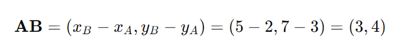

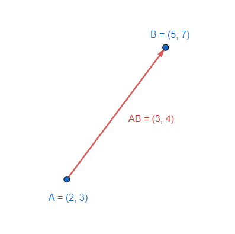

### Vector magnitude

The magnitude of a vector is the length of the vector. It represents the distance from the vector's tail to its head.

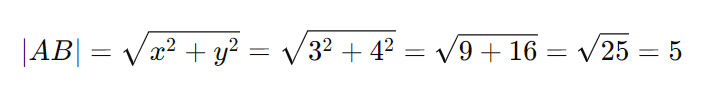

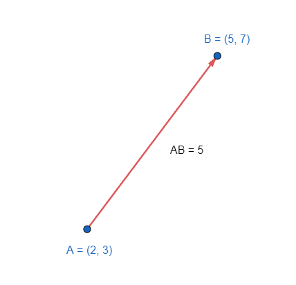

### Normalized vector

A normalized vector, also known as a unit vector, is a vector that has been scaled to have a magnitude of exactly 1, while maintaining its direction. 
Normalized vector often used as a direction vector. Ex: describing direction of forces or velocities in physics or defining orientations in graphics.

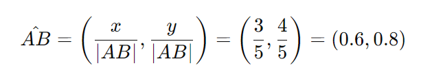

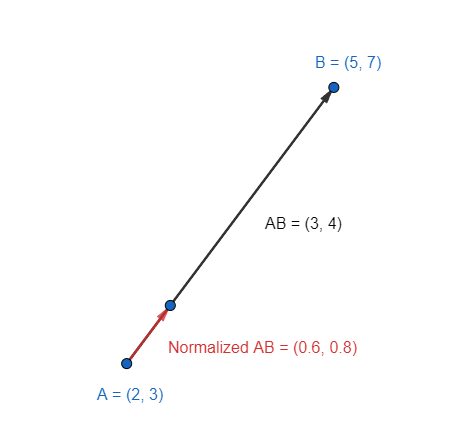

### Absolute vector
An absolute vector represents the position of a point in a coordinate system relative to the origin `(0, 0)`. It describes the point's location in the coordinate space without reference to any other point. 
Here's the calculation of an absolute vector of point `A(1,3)`

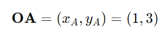

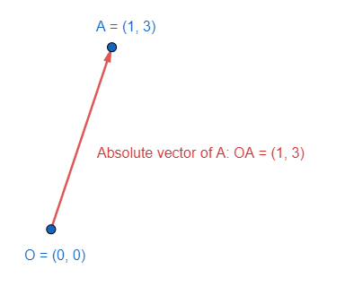

### Relative vector

A relative vector represents the position of a point in a coordinate system relative to another point. It describes the point's location in the coordinate space with reference to another point. 
In the [definition of vector](0.vector.md#what-is-a-vector) `AB(3,4)` point from `A(2,3)` to `B(5,7)`, AB is a relative vector of point A and B.

### Relative velocity

Relative velocity describes the velocity of one object relative to another, effectively describing how fast one object is moving relative to the other. It is determined by subtracting a velocity vector from another.

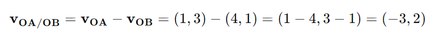
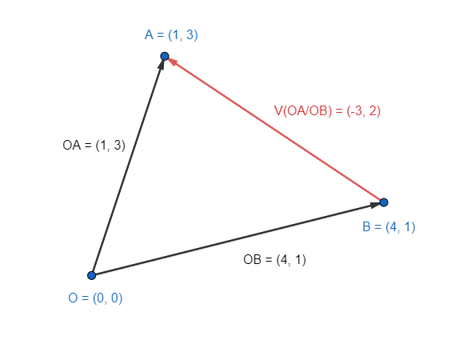

### Dot product

The dot product (also known as the scalar product) is an operation that takes two vectors and returns a single scalar value. 
Here's the calculation of the dot product of vectors `OA(1,3` and `OB(4,1)`

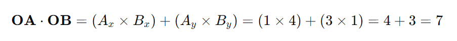

Some applications of the dot product in vector math:

- Find angle between two vectors 
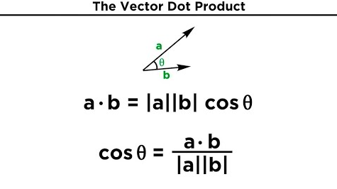
- Projection of Vectors 
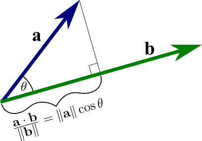
- Orthogonality 
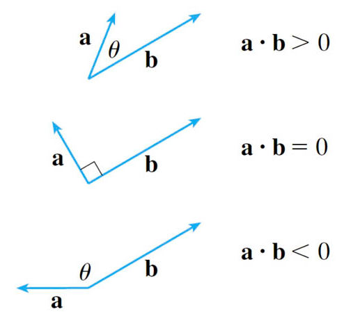
