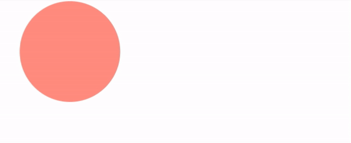
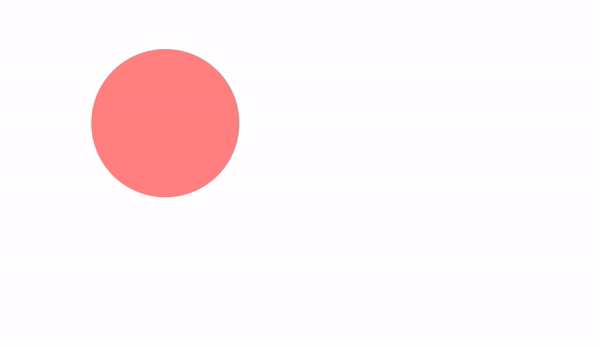
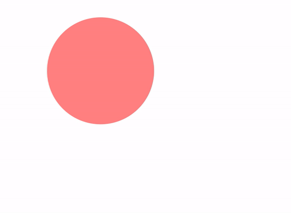
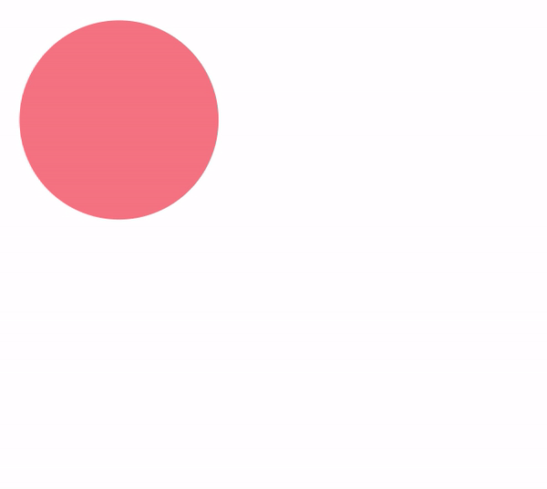
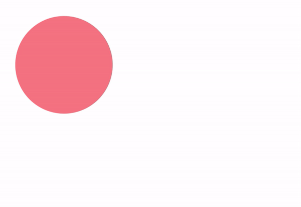
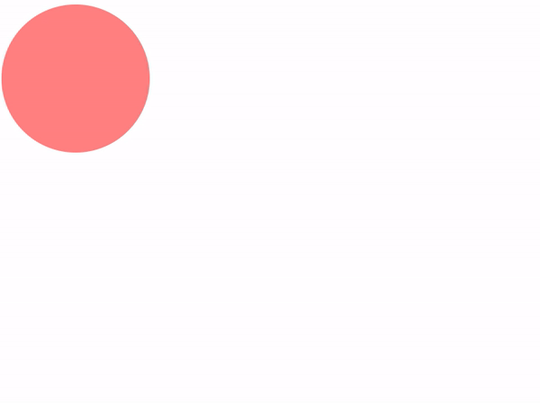
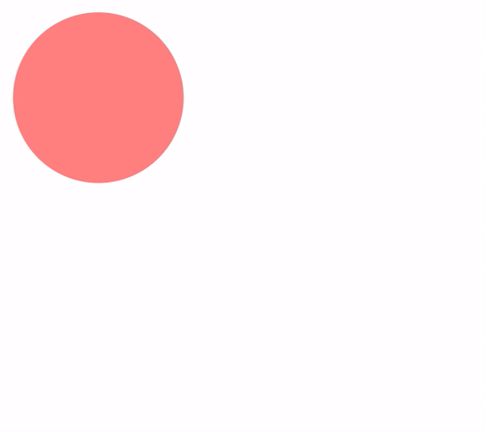
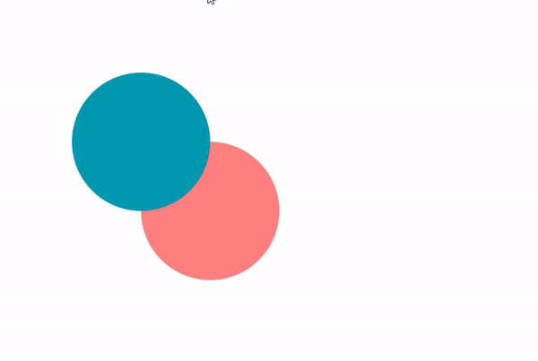
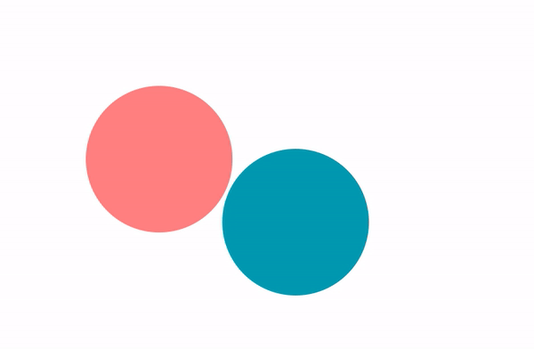
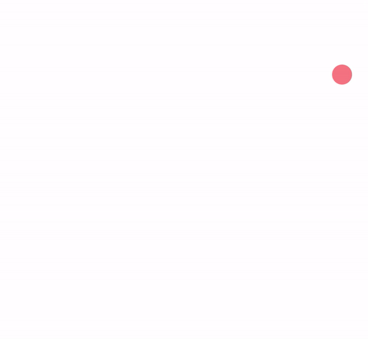

# Tween

Tween (short for "in-between") refers to a technique used to create smooth transitions between values over time. It involves calculating intermediate values between a start and end point to animate properties such as position, size, color, or other attributes of objects. <br/>
Basically, tween is a way to change one or many number values over a specific duration of time.

### Create a Tween

First, we will need an object to use our tween.

```javascript
// represents all game objects in the game
class GameObject {
    constructor(x, y) {
        this.x = x;
        this.y = y;
        this.color = "black";
    }
}

class Circle extends GameObject {
    constructor() {
        super();
        this.radius = 100;
    }

    render(ctx) {
        ctx.fillStyle = this.color;
        ctx.beginPath();
        ctx.arc(this.x, this.y, this.radius, 0, 2 * Math.PI);
        ctx.stroke();
    }
}
```

Let's create a `Tween` class that receive a **source value** and interpolate it to a **target value** over a **duration** of time.

```javascript
class Tween {
    constructor(source, target, duration) {
        this.source = source;
        this.target = target;
        this.duration = duration;
        this.elapsed = 0;
    }

    update(deltaTime) {
        this.elapsed += deltaTime;
        
        // clamp the elapsed time to the duration
        if (this.elapsed >= this.duration) {
            this.elapsed = this.duration;
        }
        
        // linear interpolation
        return this.source + (this.target - this.source) * (this.elapsed / this.duration);
    }
}
```

Now, we can use the `Tween` class to animate the `circle` position.

```javascript
// create the circle
const circle = new Circle();
circle.x = 100;
circle.y = 100;
circle.color = "#ff8080";

const tween = new Tween(circle.x, 500, 3); // move the circle to x = 500 in 3 seconds

function update(dt) {
    circle.x = tween.update(dt); // update the tween
}

function render() {
    ctx.clearRect(0, 0, canvas.width, canvas.height); // clear the canvas
    circle.render(ctx); // render the circle
}
```



This is the basic idea of a tween. We interpolate the `x` value of the circle from `100` to `500` in `3` seconds. The `update` function will return the interpolated value, and we assign it to the `x` property of the circle.<br/>

Let's translate `y` as well

```javascript
const tweenX = new Tween(circle.x, 500, 3); // move the circle to x = 500 in 3 seconds
const tweenY = new Tween(circle.y, 300, 3); // move the circle to y = 300 in 3 seconds

function update(dt) {
    circle.x = tweenX.update(dt);
    circle.y = tweenY.update(dt);
}
```



Now we have a problem. Anytime we want to animate a new property, we have to create a new `Tween` object, update it and assign the value to the object property. This can be cumbersome if we have many properties to animate.<br/>
To solve this, we can make our `Tween` class receive an object as the **source** and another object as the **target**. And then update the corresponding properties.

```javascript
class Tween {
    constructor(source, target, duration) {
        if (typeof source !== "object" || typeof target !== "object") {
            throw new Error("source and target must be objects");
        }
        
        ...
        // get the keys that need to be tweened
        this.keys = Object.keys(this.target);
        
        // store the start values
        this.start = {};
        for (let key of this.keys) {
            this.start[key] = this.source[key];
        }
    }

    update(deltaTime) {
        ...
        // linear interpolation for all keys
        for (let key of this.keys) {
            if (!this.source.hasOwnProperty(key)) {
                continue;
            }
            this.source[key] = this.start[key] + (this.target[key] - this.start[key]) * (this.elapsed / this.duration);
        }
    }
}
```

```javascript
// move the circle to x = 500 and y = 300 in 3 seconds
const tween = new Tween(circle, { x: 500, y: 300 }, 3);
function update(dt) {
    tween.update(dt);
}
```

Because we are updating the object properties directly, we need a **start** object to store the initial values for interpolation.<br/>
Now we have a same animation for both `x` and `y` properties without creating a new `Tween` for each one. Let's try to animate the `radius` as well.

```javascript
const tween = new Tween(circle, { x: 500, y: 300, radius: 200 }, 3);
```



### Easing

The `Tween` class we created uses a linear interpolation to animate the properties. This means the object will move at a constant speed from the start to the end. But in most cases, objects don’t just start and stop instantly, and almost never move at a constant speed. When we open a drawer, we first move it quickly, and slow it down as it comes out. Drop something on the floor, and it will first accelerate downwards, and then bounce back up after hitting the floor.<br/>
Easing functions are mathematical functions that specify the rate of change of a parameter over time. They can be used to create effects like acceleration, deceleration, or bouncing.<br/>

```javascript
class Tween {
    easeInSine(progress) {
        return 1 - Math.cos((progress * Math.PI) / 2);
    }
}
```

Our _Sine In_ easing function will receive a `progress` value between `0` and `1` and return a new value between `0` and `1`. This value will be used to interpolate the properties.

```javascript
this.source[key] = this.start[key] + (this.target[key] - this.start[key]) * this.easeInSine(this.elapsed / this.duration);
```


Our `Circle` object will move faster at the beginning and slow down as it reaches the target position. This is the _Sine In_ easing function. There are many more, [easings.net](https://easings.net/#) is a great resource to visualize and test different easing functions. Let's add them to our `Tween` class as static functions to make them accessible from anywhere.

```javascript
class Tween {
    static easeLinear(x) {
        return x;
    }

    static easeInSine(x) {
        return 1 - Math.cos((x * Math.PI) / 2);
    }

    static easeOutSine(x) {
        return Math.sin((x * Math.PI) / 2);
    }

    static easeInOutSine(x) {
        return -(Math.cos(Math.PI * x) - 1) / 2;
    }

    static easeInQuad(x) {
        return x * x;
    }

    static easeOutQuad(x) {
        return 1 - (1 - x) * (1 - x);
    }

    static easeInOutQuad(x) {
        return x < 0.5 ? 2 * x * x : 1 - Math.pow(-2 * x + 2, 2) / 2;
    }

    static easeInCubic(x) {
        return x * x * x;
    }

    static easeOutCubic(x) {
        return 1 - Math.pow(1 - x, 3);
    }

    static easeInOutCubic(x) {
        return x < 0.5 ? 4 * x * x * x : 1 - Math.pow(-2 * x + 2, 3) / 2;
    }

    static easeInQuart(x) {
        return x * x * x * x;
    }

    static easeOutQuart(x) {
        return 1 - Math.pow(1 - x, 4);
    }

    static easeInOutQuart(x) {
        return x < 0.5 ? 8 * x * x * x * x : 1 - Math.pow(-2 * x + 2, 4) / 2;
    }

    static easeInQuint(x) {
        return x * x * x * x * x;
    }

    static easeOutQuint(x) {
        return 1 - Math.pow(1 - x, 5);
    }

    static easeInOutQuint(x) {
        return x < 0.5 ? 16 * x * x * x * x * x : 1 - Math.pow(-2 * x + 2, 5) / 2;
    }

    static easeInExpo(x) {
        return x === 0 ? 0 : Math.pow(2, 10 * x - 10);
    }

    static easeOutExpo(x) {
        return x === 1 ? 1 : 1 - Math.pow(2, -10 * x);
    }

    static easeInOutExpo(x) {
        return x === 0
            ? 0
            : x === 1
                ? 1
                : x < 0.5
                    ? Math.pow(2, 20 * x - 10) / 2
                    : (2 - Math.pow(2, -20 * x + 10)) / 2;
    }

    static easeInCirc(x) {
        return 1 - Math.sqrt(1 - Math.pow(x, 2));
    }

    static easeOutCirc(x) {
        return Math.sqrt(1 - Math.pow(x - 1, 2));
    }

    static easeInOutCirc(x) {
        return x < 0.5
            ? (1 - Math.sqrt(1 - Math.pow(2 * x, 2))) / 2
            : (Math.sqrt(1 - Math.pow(-2 * x + 2, 2)) + 1) / 2;
    }

    static easeInBack(x) {
        const c1 = 1.70158;
        const c3 = c1 + 1;
        return c3 * x * x * x - c1 * x * x;
    }

    static easeOutBack(x) {
        const c1 = 1.70158;
        const c3 = c1 + 1;
        return 1 + c3 * Math.pow(x - 1, 3) + c1 * Math.pow(x - 1, 2);
    }

    static easeInOutBack(x) {
        const c1 = 1.70158;
        const c2 = c1 * 1.525;
        return x < 0.5
            ? (Math.pow(2 * x, 2) * ((c2 + 1) * 2 * x - c2)) / 2
            : (Math.pow(2 * x - 2, 2) * ((c2 + 1) * (x * 2 - 2) + c2) + 2) / 2;
    }

    static easeInElastic(x) {
        const c4 = (2 * Math.PI) / 3;
        return x === 0
            ? 0
            : x === 1
                ? 1
                : -Math.pow(2, 10 * x - 10) * Math.sin((x * 10 - 10.75) * c4);
    }

    static easeOutElastic(x) {
        const c4 = (2 * Math.PI) / 3;
        return x === 0
            ? 0
            : x === 1
                ? 1
                : Math.pow(2, -10 * x) * Math.sin((x * 10 - 0.75) * c4) + 1;
    }

    static easeInOutElastic(x) {
        const c5 = (2 * Math.PI) / 4.5;
        return x === 0
            ? 0
            : x === 1
                ? 1
                : x < 0.5
                    ? -(Math.pow(2, 20 * x - 10) * Math.sin((20 * x - 11.125) * c5)) / 2
                    : (Math.pow(2, -20 * x + 10) * Math.sin((20 * x - 11.125) * c5)) / 2 + 1;
    }

    static easeInBounce(x) {
        return 1 - Tween.easeOutBounce(1 - x);
    }

    static easeOutBounce(x) {
        const n1 = 7.5625;
        const d1 = 2.75;
        if (x < 1 / d1) {
            return n1 * x * x;
        } else if (x < 2 / d1) {
            return n1 * (x -= 1.5 / d1) * x + 0.75;
        } else if (x < 2.5 / d1) {
            return n1 * (x -= 2.25 / d1) * x + 0.9375;
        } else {
            return n1 * (x -= 2.625 / d1) * x + 0.984375;
        }
    }

    static easeInOutBounce(x) {
        return x < 0.5
            ? (1 - Tween.easeOutBounce(1 - 2 * x)) / 2
            : (1 + Tween.easeOutBounce(2 * x - 1)) / 2;
    }
}
```

Now we change our `Tween` class to receive an easing function.

```javascript
class Tween {
    constructor(source, target, duration, easing = Tween.easeLinear) {
        ...
        this.easing = easing;
    }

    update(deltaTime) {
        ...
        for (let key of this.keys) {
            if (!this.source.hasOwnProperty(key)) {
                continue;
            }
            this.source[key] = this.start[key] + (this.target[key] - this.start[key]) * this.easing(this.elapsed / this.duration);
        }
    }
}
```

```javascript
const tween = new Tween(circle, { x: 300, y: 300, radius: 200 }, 2, Tween.easeInOutBounce);
```



### More configurations

Our `Tween` class is animating the properties of an object from a start value to an end value over a duration of time with an easing function. We can add more configurations to it, like **delay**, **repeat**, **yoyo**.<br/>
First, we need to change the `Tween` class to receive a **config** object to store all these configurations instead of passing them as arguments to make the constructor more readable.

```javascript
class Tween {
    constructor(source, target, config = {}) {
        ...
        this.duration = config.duration || 1;
        this.easing = config.easing || Tween.easeLinear;
        ...
    }
}
```

Now we can add the **delay** configuration.

```javascript
    this.delay = config.delay || 0;
    this.elapsed = -this.delay;
    
    update(deltaTime) {
        this.elapsed += deltaTime;
        
        if (this.elapsed < 0) {
            return;
        }
        
        ...
    }
```
```javascript
    const tween = new Tween(circle,
    {
        x: 300,
        y: 300,
        radius: 200
    },
    {
        delay: 2,
        duration: 2,
        easing: Tween.easeInOutBounce
    });
```



Let add **repeat** to make the tween repeat a number of times and **yoyo** to make it go back and forth.

```javascript
    this.repeat = config.repeat || 0;
    this.yoyo = config.yoyo || false;
    this.repeatCount = 0;
    
    update(deltaTime) {
        this.elapsed += deltaTime;
    
        if (this.elapsed >= this.duration) {
            // tween finished or repeated
            if (this.repeatCount < this.repeat) {
                this.onRepeat();
                this.elapsed = -this.delay; // reset the elapsed time
                this.repeatCount++;
            }
            else {
                this.elapsed = this.duration;
            }
        }
    
        if (this.elapsed < 0) {
            return;
        }
        
        ...
    }

    onRepeat() {
        if (this.yoyo) {
            // swap start and target to create a yoyo effect
            for (let key of this.keys) {
                let temp = this.start[key];
                this.start[key] = this.target[key];
                this.target[key] = temp;
            }
        }
        else {
            // reset the properties
            for (let key of this.keys) {
                this.source[key] = this.start[key];
            }
        }
    }
```
```javascript
    const tween = new Tween(circle,
    {
        x: 300,
        y: 300,
        radius: 200
    },
    {
        delay: 1,
        duration: 2,
        easing: Tween.easeInOutBounce,
        repeat: 2,
        yoyo: true
    });
```



We can set the `repeat` to `Infinity` to make the tween loop forever.

### Tween Manager

Let's create another object with another `Tween`.

```javascript
const circle1 = new Circle();
circle1.x = 100;
circle1.y = 100;
circle1.color = "#ff8080";

const circle2 = new Circle();
circle2.x = 400;
circle2.y = 300;
circle2.color = "#0099b0";

const tweenCircle1 = new Tween(circle1, { x: 300, y: 300 }, { duration: 2 });
const tweenCircle2 = new Tween(circle2, { x: 200, y: 200 }, { duration: 2 });

function update(dt) {
    tweenCircle1.update(dt);
    tweenCircle2.update(dt);
}
```



Now image you have hundreds of objects and you want to animate them. You will have to create a `Tween` for each object and update them in the `update` loop. This can be cumbersome and error-prone.<br/>
To solve this, we can create a `TweenManager` class that will handle all the tweens for us. It will be a static class and can be accessed from anywhere in the game.

```javascript
class TweenManager {
    static tweens = [];

    static create(source, target, config) {
        const tween = new Tween(source, target, config);
        this.tweens.push(tween);
        return tween;
    }

    static update(dt) {
        for (let tween of this.tweens) {
            tween.update(dt);
        }
    }
}
```

```javascript
TweenManager.create(circle1, { x: 300, y: 300 }, { duration: 2 });
TweenManager.create(circle2, { x: 200, y: 200 }, { duration: 2 });

function update(dt) {
    TweenManager.update(dt);
}
```

### Events

We can add events to our `Tween` class to notify when the tween starts, ends, repeats, etc. These events can be used to trigger other actions in the game, or to chain tweens together.<br/>
First, let's make our `Tween` only update when it is active.

```javascript
class Tween {
    constructor(source, target, config) {
    ...
        this.active = false;
    }
}
```

```javascript
class TweenManager {
    static update(dt) {
        for (let tween of this.tweens) {
            if (tween.active) {
                tween.update(dt);
            }
        }
    }
}
```

Then add a `play` function to activate the `Tween` and call the `onStart` event.

```javascript
class Tween {
    constructor(source, target, config) {
        ...
        this.onStartCallback = config.onStart || null;
        ...
    }
    
    start() {
        this.active = true;
        this.onStartCallback?.();
    }
}
```

```javascript
    const tweenCircle2 = TweenManager.create(circle2, {x: 200, y: 200}, {duration: 2});
    const tweenCircle1 = TweenManager.create(circle1,
        {
            x: 300,
            y: 300
        },
        {
            duration: 2,
            onStart: () => {
                tweenCircle2.play();
            }
        });
    tweenCircle1.play();
```
Now the `tweenCircle2` will start when the `tweenCircle1` starts. It has the same animation as before but that's the idea.<br/>
Let's add the **complete** event.
```javascript
class Tween {
    constructor(source, target, config) {
        ...
        this.onCompleteCallback = config.onComplete || null;
        ...
    }

    onComplete() {
        this.active = false;
        this.onCompleteCallback?.();
    }
}
```

```javascript
    const tweenCircle2 = TweenManager.create(circle2, {x: 200, y: 200}, { duration: 2 });
    const tweenCircle1 = TweenManager.create(circle1,
        {
            x: 300,
            y: 300
        },
        {
            duration: 2,
            onComplete: () => {
                tweenCircle2.play();
                TweenManager.create(circle1, { x: 350, y: 100 }, { duration: 2 }).play();
            }
        });
    tweenCircle1.play();
```



Now the `tweenCircle2` will start and another tween created to move `circle1` when the `tweenCircle1` ends. This is called **chained tween**. Many animations will require a sequence of tweens to be played one after the other. Call the `play` function of the next tween in the `onComplete` event for a numberous of tweens is not a good idea. We should create a `TweenSequence` class that managed by `TweenManager` or just a `chain` function for `Tween` class. But that is another story, you can implement it yourself.<br/>

Let's add the **update** and **repeat**.

```javascript
class Tween {
    constructor(source, target, config) {
        ...
        this.onUpdateCallback = config.onUpdate;
        this.onRepeatCallback = config.onRepeat;
    }

    update(deltaTime) {
        ...
        this.onUpdateCallback?.();
    }
    
    onRepeat() {
        ...
        this.onRepeatCallback?.();
    }
}
```

`Tween` class is now complete. You can implement more configurations, events and functions to make it more powerful and flexible.<br/>
The animations in this article are simple and boring. Try make something more interesting and creative.<br/>
```javascript
const circle = new Circle();
    circle.x = 100;
    circle.y = 100;
    circle.radius = 20;
    circle.color = "#ff8080";

    TweenManager.create(circle, {x: 700}, {
        duration: 1,
        repeat: Infinity,
        yoyo: true,
        easing: Tween.easeInOutCubic
    }).play();

    TweenManager.create(circle, {y: 500}, {
        duration: 5,
        repeat: Infinity,
        yoyo: true,
        easing: Tween.easeInOutBounce
    }).play();

    TweenManager.create(circle, {radius: 50}, {
        duration: 0.25,
        repeat: Infinity,
        yoyo: true,
        easing: Tween.easeInOutCubic
    }).play();
```

