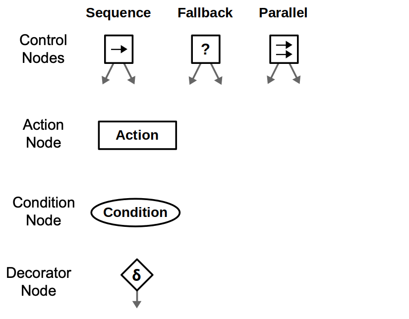
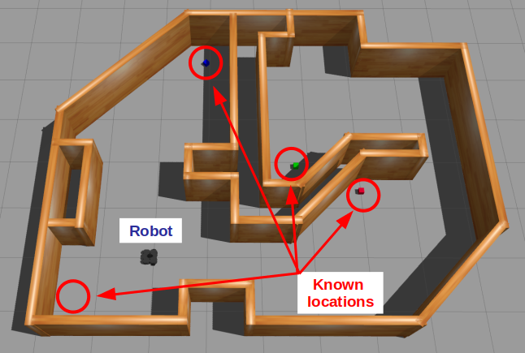
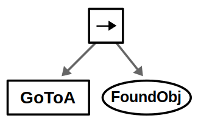
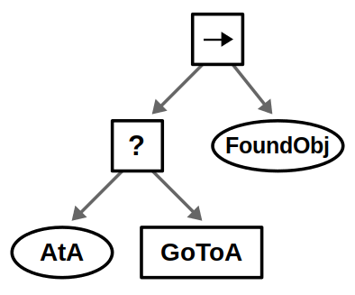
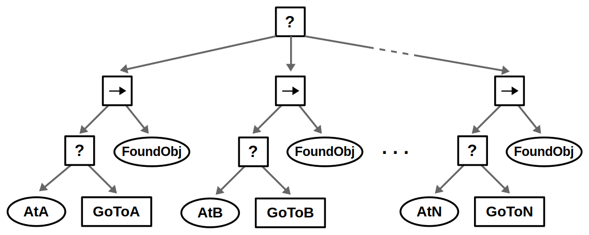
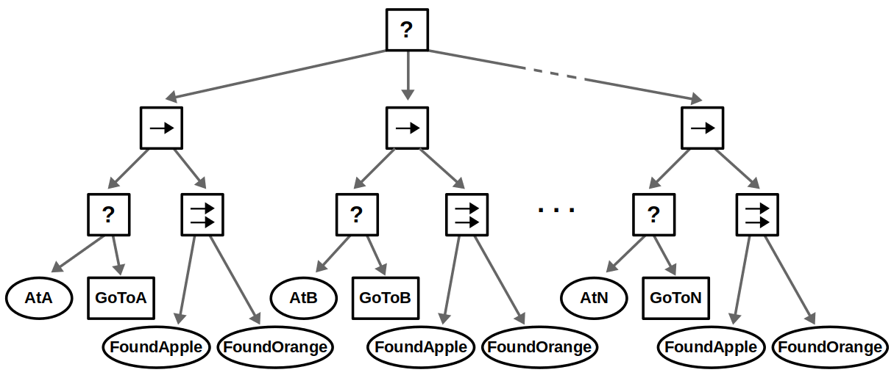

# Behavior Tree

### Key concepts

A behavior tree hierarchical model used in artificial intelligence (AI) to control decision-making and behaviors, particularly in robotics, game AI, and autonomous systems. It organizes tasks and actions into a tree structure, where each node represents a behavior or decision.<br/>

The tree is followed from the top (root) to the bottom (leaves), each node decides which next step to take based on specific conditions or results (success, failure, or still running).
- A signal called **"tick"** is sent to the root of the tree and propagates through the tree until it reaches a leaf node.
- Any Node that receives a tick signal executes its callback. This callback must return either
  - **SUCCESS**
  - **FAILURE**
  - **RUNNING**
- **RUNNING** means that the action needs more time to return a valid result.
- If a Node has one or more children, it is its responsibility to propagate the tick; each Node type may have different rules about if, when, and how many times children are ticked.
- The **Leaf Nodes**, which don't have any children, are the actual commands. **Action** nodes are the most common type of **Leaf Nodes**.



### Nodes

The nodes are the individual elements that represent specific actions, decisions, or control flow mechanisms. Each node plays a role in defining how the AI behaves. There are several types of nodes, each node returns a state **(Success, Failure, Running)** and serving a different purpose:



1. Action nodes: which are leaves of the behavior tree, perform a specific task or action, like moving, attacking, or playing an animation.
2. Condition nodes: check a condition and return either success or failure, like checking if the player is in sight or if the health is low.
3. Control Nodes, which are manage the flow of the tree<br/>
   - Sequence Node: Executes its child nodes in order, stopping if one fails
   - Fallback Node (aka Selector Node): Executes its child nodes in order, stopping if one succeeds
   - Parallel Node: Executes multiple child nodes at the same time and returns success or failure based on how many succeed
4. Decorator Node: modify a single child node with a custom policy, like Invert, Repeat / Retry, Timeout, Force Failure, Success Is Failure, etc

### Robot example: searching for objects

Suppose we have a mobile robot that must search for specific objects in a home environment. Assume the robot already know all the objects' locations and can move around the house.



Let's start simple with the robot go to a location (we'll call it **A**). The behavior tree is a simple sequence of the necessary actions: Go to the location and then look for the object.



We’ve chosen to represent navigation as an action node, as it may take some time for the robot to move (returning Running in the process). On the other hand, we represent vision as a condition node, assuming the robot can detect the object from a single image once it arrives at its destination.

One very common design principle is **explicit success condition**, which means you should almost always check before you act. For example, before moving to a location, you should check if you are already there.



Explicit success conditions use a Fallback node with a condition preceding an action. The guarded action will only execute if the condition is not met — in this example if the robot is not at location **A**.

Our robot likely operates in an environment with multiple locations, and the idea is to look in all possible locations until we find the object we want. This can be done by introducing a root-level Fallback node and repeating the above behavior for each location in some specified order.



Finally, suppose that instead of looking for a single object, we want to consider several objects — let’s say apples and oranges. This use case of composing conditions can be done with Parallel nodes as shown below.

- If we accept either an apple or an orange (“OR” condition), then we succeed if one node returns Success
- If we require both an apple and an orange (“AND” condition), then we succeed if both nodes return Success
- If we care about the order of objects, e.g., you must find an apple before finding an orange, then this could be done with a Sequence node instead



### Implementations

There are several libraries and frameworks that implemented the behavior tree. But to understand the concept, we can implement a simple behavior tree from scratch.

First, we need to define the statuses of the nodes, which are Success, Failure, Running and another Ready status to indicate that the node isn't ticked yet:

```typescript
enum Status {
    Ready,
    Success, 
    Failure, 
    Running,
}
```

And an abstract class for the nodes, which have a `Status` property and a `update` function to call `tick` and assign the result status to the property. All nodes will inherit from this class and implement the `tick` function.

```typescript
abstract class Node {
    private _status = Status.Ready;
    public get status() {
        return this._status;
    }

    update() {
        this._status = this.tick();
    }

    protected abstract tick(): Status;
}
```

`Action` nodes will receive a function that return a `Status` as an action:

```typescript
class Action extends Node {
    private action: () => Status;

    constructor(action: () => Status) {
        super();
        this.action = action;
    }

    protected override tick(): Status {
        return this.action();
    }
}
```

Condition nodes will receive a function that returns a boolean as a condition:

```typescript
class Condition extends Node {
    private condition: () => boolean;

    constructor(condition: () => boolean) {
        super();
        this.condition = condition;
    }

    protected override tick(): Status {
        return this.condition() ? Status.Success : Status.Failure;
    }
}
```

`Sequence`, `Fallback` and `Parallel` will have an array of children nodes, we need a `Composite` class to handle the children:

```typescript
abstract class Composite extends Node {
    protected children: Node[];

    constructor(children: Node[]) {
        super();
        this.children = children;
    }

    addChild(child: Node) {
        this.children.push(child);
    }
}
```

Now we can implement the `Sequence` and `Fallback`, which will tick each child in order:

```typescript
class Sequence extends Composite {
    protected override tick(): Status {
        for (const child of this.children) {
            if (child.status === Status.Ready || child.status === Status.Running) {
                child.update(); // update ready or running children
            }

            if (child.status !== Status.Success) {
                return child.status; // return on first failure or running
            }
        }
        return Status.Success; // all children succeeded
    }
}
```

```typescript
class Fallback extends Composite {
    protected override tick(): Status {
        for (const child of this.children) {
            if (child.status === Status.Ready || child.status === Status.Running) {
                child.update(); // update ready or running children
            }

            if (child.status !== Status.Failure) {
                return child.status; // return on first success or running
            }
        }
        return Status.Failure; // all children failed
    }
}
```

`Parallel` will tick all children at the same time and return `Status` based on how many succeed:

```typescript
class Parallel extends Composite {
    private requiredSuccesses: number;

    constructor(requiredSuccesses: number, children: Node[]) {
        super(children);
        this.requiredSuccesses = requiredSuccesses;
    }

    protected override tick(): Status {
        let successCount = 0;
        let runningCount = 0;

        for (const child of this.children) {
            if (child.status === Status.Failure) {
                continue; // skip failures
            }

            if (child.status === Status.Ready || child.status === Status.Running) {
                child.update(); // update ready or running children
            }

            if (child.status === Status.Success) {
                successCount++;
            } else if (child.status === Status.Running) {
                runningCount++;
            }
        }

        if (successCount >= this.requiredSuccesses) {
            return Status.Success; // enough successes
        }

        return runningCount > 0 ? Status.Running : Status.Failure; // return running if any node is running, otherwise failure
    }
}
```

`Decorator` will modify a single child node with a custom policy, we need an abstract class for the decorators:

```typescript
abstract class Decorator extends Node {
    protected child: Node;
    
    constructor(child: Node) {
        super();
        this.child = child;
    }
}
```

For example, `Invert` will invert the result of the child node:

```typescript
class Invert extends Decorator {
    protected override tick(): Status {
        this.child.update();
        if (this.child.status === Status.Success) {
            return Status.Failure;
        } else if (this.child.status === Status.Failure) {
            return Status.Success;
        }
        return this.child.status;
    }
}
```

Or `Repeat` will repeat the child node a number of times, return `Sucess` if all repetitions succeed, or `Failure` if any repetition fails:

```typescript
class Repeat extends Decorator {
    private count: number;
    private repeated: number = 0;
    
    constructor(count: number, child: Node) {
        super(child);
        this.count = count;
    }

    protected override tick(): Status {
        if (this.repeated < this.count) {
            this.child.update();
            if (this.child.status === Status.Failure) {
                return Status.Failure;
            }

            if (this.child.status === Status.Success) {
                this.repeated++;
            }
            
            return this.repeated < this.count ? Status.Running : Status.Success;
        }

        return Status.Success; // All repetitions succeeded
    }
}
```

We have all the basic nodes to implement a behavior tree. Let's see an example of a robot that moves to location **A** and then to location **B**:

```typescript
const robotPosition = {x: 0, y: 0};

function atA() {
    return robotPosition.x >= 10;
}

function atB() {
    return robotPosition.y >= 10;
}

function moveToA() {
    robotPosition.x++;
    console.log("Moving to A", robotPosition.x);
    return atA() ? Status.Success : Status.Running;
}

function moveToB() {
    robotPosition.y++;
    console.log("Moving to B", robotPosition.y);
    return atB() ? Status.Success : Status.Running;
}

const behaviorTree = new Sequence([
    new Fallback([
        new Condition(atA),
        new Action(moveToA),
    ]),
    new Fallback([
        new Condition(atB),
        new Action(moveToB),
    ]),
]);

window.requestAnimationFrame(() => behaviorTree.update());
```

This example is oversimplified, but it shows how to implement a behavior tree from scratch. In a real-world scenario, you would have more complex conditions and actions, and you would need to handle more edge cases.
