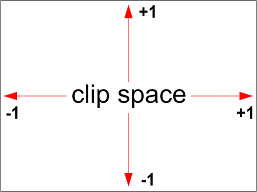

# WebGL fundamentals

## Fundamentals

WebGL (Web Graphics Library) is often thought of as a 3D API. People think "I'll use WebGL and magic, I'll get cool 3d". In reality, WebGL is just a rasterization engine. It draws points, lines, and triangles based on code you supply. Getting WebGL to do anything else is up to you to provide code to use points, lines, and triangles to accomplish your task.

WebGL runs on the GPU on your computer. As such, you need to provide the code that runs on that GPU. You provide that code in the form of pairs of functions. Those 2 functions are called a **vertex shader** and a **fragment shader** and they are each written in a very strictly typed C/C++ like language called [GLSL](https://www.khronos.org/opengl/wiki/OpenGL_Shading_Language) (GL Shader Language). Paired together, they are called a **program**.

A vertex shader's job is to compute vertex positions. Based on the positions the function outputs WebGL can then rasterize various kinds of primitives including points, lines, or triangles. When rasterizing these primitives, it calls a second user supplied function called a fragment shader. A fragment shader's job is to compute a color for each pixel of the primitive currently being drawn.

Nearly all the entire WebGL API is about setting up state for these pairs of functions to run. For each thing you want to draw you setup a bunch of state then execute a pair of functions by calling ```gl.drawArrays``` or ```gl.drawElements``` which executes your shaders on the GPU.

Any data you want those functions to have access to must be provided to the GPU. There are 4 ways a shader can receive data.

1. Attributes and Buffers
   * Buffers are arrays of binary data you upload to the GPU. Usually buffers contain things like positions, normals, texture coordinates, vertex colors, etc although you're free to put anything you want in them.
   * Attributes are used to specify how to pull data out of your buffers and provide them to your vertex shader. For example you might put positions in a buffer as three 32bit floats per position. You would tell a particular attribute which buffer to pull the positions out of, what type of data it should pull out (3 component 32 bit floating point numbers), what offset in the buffer the positions start, and how many bytes to get from one position to the next.
   * Buffers are not random access. Instead, a vertex shader is executed a specified number of times. Each time it's executed the next value from each specified buffer is pulled out and assigned to an attribute.
2. Uniforms
   * Uniforms are effectively global variables you set before you execute your shader program.
3. Textures
   * Textures are arrays of data you can randomly access in your shader program. The most common thing to put in a texture is image data but textures are just data and can just as easily contain something other than colors.
4. Varyings
   * Varyings are a way for a vertex shader to pass data to a fragment shader. Depending on what is being rendered, points, lines, or triangles, the values set on a varying by a vertex shader will be interpolated while executing the fragment shader.

## WebGL Hello World

WebGL only cares about 2 things: clip space coordinates and colors. Your job as a programmer using WebGL is to provide WebGL with those 2 things. You provide your 2 "shaders" to do this. A Vertex shader which provides the clip space coordinates, and a fragment shader that provides the color.

Clip space coordinates always go from -1 to +1 no matter what size your canvas is.



Here is a simple WebGL example that shows WebGL in its simplest form.

Let's start with a vertex shader

```javascript
// an attribute will receive data from a buffer
attribute vec4 a_position;
 
// all shaders have a main function
void main() {
 
  // gl_Position is a special variable a vertex shader
  // is responsible for setting
  gl_Position = a_position;
}
```

When executed, if the entire thing was written in JavaScript instead of GLSL you could imagine it would be used like this

```javascript
// *** PSEUDO CODE!! ***
 
var positionBuffer = [
  0, 0, 0, 0,
  0, 0.5, 0, 0,
  0.7, 0, 0, 0,
];
var attributes = {};
var gl_Position;
 
drawArrays(..., offset, count) {
  var stride = 4;
  var size = 4;
  for (var i = 0; i < count; ++i) {
     // copy the next 4 values from positionBuffer to the a_position attribute
     const start = offset + i * stride;
     attributes.a_position = positionBuffer.slice(start, start + size);
     runVertexShader();
     ...
     doSomethingWith_gl_Position();
}
```

In reality, it's not quite that simple because ```positionBuffer``` would need to be converted to binary data (see below) and so the actual computation for getting data out of the buffer would be a little different but hopefully this gives you an idea of how a vertex shader will be executed.

Next, we need a fragment shader

```javascript
// fragment shaders don't have a default precision so we need
// to pick one. mediump is a good default. It means "medium precision"
precision mediump float;
 
void main() {
  // gl_FragColor is a special variable a fragment shader
  // is responsible for setting
  gl_FragColor = vec4(1, 0, 0.5, 1); // return reddish-purple
}
```

Above we're setting ```gl_FragColor``` to ```1, 0, 0.5, 1``` which is 1 for red, 0 for green, 0.5 for blue, 1 for alpha. Colors in WebGL go from 0 to 1.

Now that we have written the 2 shader functions lets get started with WebGL

First we need an HTML canvas element

```html
 <canvas id="c"></canvas>
```

Then in JavaScript we can look that up

```javascript
 var canvas = document.querySelector("#c");
```

Now we can create a WebGLRenderingContext

```javascript
 var gl = canvas.getContext("webgl");
 if (!gl) {
     // no webgl for you!
 }
```

Now we need to compile those shaders to put them on the GPU so first we need to get them into strings. You can create your GLSL strings any way you normally create strings in JavaScript: by concatenating, by using AJAX to download them, by using multiline template strings. Or in this case, by putting them in non-JavaScript typed script tags.

```html
<script id="vertex-shader-2d" type="notjs">
 
  // an attribute will receive data from a buffer
  attribute vec4 a_position;
 
  // all shaders have a main function
  void main() {
 
    // gl_Position is a special variable a vertex shader
    // is responsible for setting
    gl_Position = a_position;
  }
 
</script>
 
<script id="fragment-shader-2d" type="notjs">
 
  // fragment shaders don't have a default precision so we need
  // to pick one. mediump is a good default
  precision mediump float;
 
  void main() {
    // gl_FragColor is a special variable a fragment shader
    // is responsible for setting
    gl_FragColor = vec4(1, 0, 0.5, 1); // return reddish-purple
  }
 
</script>
```

In fact, most 3D engines generate GLSL shaders on the fly using various types of templates, concatenation, etc. For the samples on this site though none of them are complex enough to need to generate GLSL at runtime.

Next, we need a function that will create a shader, upload the GLSL source, and compile the shader.

```javascript
function createShader(gl, type, source) {
  var shader = gl.createShader(type);
  gl.shaderSource(shader, source);
  gl.compileShader(shader);
  var success = gl.getShaderParameter(shader, gl.COMPILE_STATUS);
  if (success) {
    return shader;
  }
 
  console.log(gl.getShaderInfoLog(shader));
  gl.deleteShader(shader);
}
```

We can now call that function to create the two shaders

```javascript
var vertexShaderSource = document.querySelector("#vertex-shader-2d").text;
var fragmentShaderSource = document.querySelector("#fragment-shader-2d").text;
 
var vertexShader = createShader(gl, gl.VERTEX_SHADER, vertexShaderSource);
var fragmentShader = createShader(gl, gl.FRAGMENT_SHADER, fragmentShaderSource);
```

We then need to link those two shaders into a program

```javascript
function createProgram(gl, vertexShader, fragmentShader) {
  var program = gl.createProgram();
  gl.attachShader(program, vertexShader);
  gl.attachShader(program, fragmentShader);
  gl.linkProgram(program);
  var success = gl.getProgramParameter(program, gl.LINK_STATUS);
  if (success) {
    return program;
  }
 
  console.log(gl.getProgramInfoLog(program));
  gl.deleteProgram(program);
}
```

And call it

```javascript
var program = createProgram(gl, vertexShader, fragmentShader);
```

Now that we've created a GLSL program on the GPU we need to supply data to it. The majority of the WebGL API is about setting up state to supply data to our GLSL programs. In this case our only input to our GLSL program is ```a_position``` which is an attribute. The first thing we should do is look up the location of the attribute for the program we just created

```javascript
var positionAttributeLocation = gl.getAttribLocation(program, "a_position");
```

Looking up attribute locations (and uniform locations) is something you should do during initialization, not in your render loop.

Attributes get their data from buffers, so we need to create a buffer

```javascript
var positionBuffer = gl.createBuffer();
```

WebGL lets us manipulate many WebGL resources on global bind points. You can think of bind points as internal global variables inside WebGL. First you bind a resource to a bind point. Then, all other functions refer to the resource through the bind point. So, let's bind the position buffer.

```javascript
gl.bindBuffer(gl.ARRAY_BUFFER, positionBuffer);
```

Now we can put data in that buffer by referencing it through the bind point

```javascript
// three 2d points
var positions = [
  0, 0,
  0, 0.5,
  0.7, 0,
];
gl.bufferData(gl.ARRAY_BUFFER, new Float32Array(positions), gl.STATIC_DRAW);
```

There's a lot going on here. The first thing is we have ```positions``` which is a JavaScript array. WebGL on the other hand needs strongly typed data so the part ```new Float32Array(positions)``` creates a new array of 32bit floating point numbers and copies the values from ```positions```. ```gl.bufferData``` then copies that data to the ```positionBuffer``` on the GPU. It's using the position buffer because we bound it to the ```ARRAY_BUFFER``` bind point above.

The last argument, ```gl.STATIC_DRAW``` is a hint to WebGL about how we'll use the data. WebGL can try to use that hint to optimize certain things. ```gl.STATIC_DRAW``` tells WebGL we are not likely to change this data much.

The code up to this point is initialization code. Code that gets run once when we load the page. The code below this point is rendering code or code that should get executed each time we want to render/draw.

## Rendering

We need to tell WebGL how to convert from the clip space values we'll be setting gl_Position to back into pixels, often called screen space. To do this we call gl.viewport and pass it the current size of the canvas.

```javascript
gl.viewport(0, 0, gl.canvas.width, gl.canvas.height);
```

This tells WebGL the -1 +1 clip space maps to 0 ```gl.canvas.width``` for x and 0 ```gl.canvas.height``` for y.

We clear the canvas. ```0, 0, 0, 0``` are red, green, blue, alpha respectively, so in this case we're making the canvas transparent.

```javascript
// Clear the canvas
gl.clearColor(0, 0, 0, 0);
gl.clear(gl.COLOR_BUFFER_BIT);
```

We tell WebGL which shader program to execute.

```javascript
// Tell it to use our program (pair of shaders)
gl.useProgram(program);
```

Next, we need to tell WebGL how to take data from the buffer we setup above and supply it to the attribute in the shader. First off we need to turn the attribute on

```javascript
gl.enableVertexAttribArray(positionAttributeLocation);
```

Then we need to specify how to pull the data out

```javascript
// Bind the position buffer.
gl.bindBuffer(gl.ARRAY_BUFFER, positionBuffer);
 
// Tell the attribute how to get data out of positionBuffer (ARRAY_BUFFER)
var size = 2;          // 2 components per iteration
var type = gl.FLOAT;   // the data is 32bit floats
var normalize = false; // don't normalize the data
var stride = 0;        // 0 = move forward size * sizeof(type) each iteration to get the next position
var offset = 0;        // start at the beginning of the buffer
gl.vertexAttribPointer(positionAttributeLocation, size, type, normalize, stride, offset)
```

A hidden part of ```gl.vertexAttribPointer``` is that it binds the current ```ARRAY_BUFFER``` to the attribute. In other words now this attribute is bound to ```positionBuffer```. That means we're free to bind something else to the ```ARRAY_BUFFER``` bind point. The attribute will continue to use ```positionBuffer```.

Note that from the point of view of our GLSL vertex shader the ```a_position``` attribute is a ```vec4```

```
attribute vec4 a_position;
```

```vec4``` is a 4 float value. In JavaScript you could think of it something like ```a_position = {x: 0, y: 0, z: 0, w: 0}```. Above we set ```size = 2```. Attributes default to ```0, 0, 0, 1``` so this attribute will get its first 2 values (x and y) from our buffer. The z, and w will be the default 0 and 1 respectively.

After all that we can finally ask WebGL to execute our GLSL program.

```javascript
var primitiveType = gl.TRIANGLES;
var offset = 0;
var count = 3;
gl.drawArrays(primitiveType, offset, count);
```

Because the count is 3 this will execute our vertex shader 3 times. The first time ```a_position.x``` and ```a_position.y``` in our vertex shader attribute will be set to the first 2 values from the ```positionBuffer```. The second time ```a_position.x``` and ```a_position.y``` will be set to the second 2 values. The last time they will be set to the last 2 values.

Because we set ```primitiveType``` to ```gl.TRIANGLES```, each time our vertex shader is run 3 times WebGL will draw a triangle based on the 3 values we set ```gl_Position``` to. No matter what size our canvas is those values are in clip space coordinates that go from -1 to 1 in each direction.

Because our vertex shader is simply copying our ```positionBuffer``` values to ```gl_Position``` the triangle will be drawn at clip space coordinates

```
  0, 0,
  0, 0.5,
  0.7, 0,
```

Converting from clip space to screen space if the canvas size happened to be 400x300 we'd get something like this

WebGL will now render that triangle. For every pixel it is about to draw WebGL will call our fragment shader. Our fragment shader just sets ```gl_FragColor``` to ```1, 0, 0.5, 1```. Since the Canvas is an 8bit per channel canvas that means WebGL is going to write the values ```[255, 0, 127, 255]``` into the canvas.


In the case above, you can see our vertex shader is doing nothing but passing on our position data directly. Since the position data is already in clip space there is no work to do. _If you want 3D it's up to you to supply shaders that convert from 3D to clip space because WebGL is only a rasterization API_.

You might be wondering why does the triangle start in the middle and go to toward the top right. Clip space in ```x``` goes from -1 to +1. That means 0 is in the center and positive values will be to the right of that.

As for why it's on the top, in clip space -1 is at the bottom and +1 is at the top. That means 0 is in the center and so positive numbers will be above the center.

For 2D stuff you would probably rather work in pixels than clip space so let's change the shader so we can supply the position in pixels and have it convert to clip space for us. Here's the new vertex shader

```javascript
attribute vec2 a_position;

uniform vec2 u_resolution;

void main() {
   // convert the position from pixels to 0.0 to 1.0
   vec2 zeroToOne = a_position / u_resolution;

   // convert from 0->1 to 0->2
   vec2 zeroToTwo = zeroToOne * 2.0;

   // convert from 0->2 to -1->+1 (clip space)
   vec2 clipSpace = zeroToTwo - 1.0;

   gl_Position = vec4(clipSpace, 0, 1);
}
```

Some things to notice about the changes. We changed ```a_position``` to a ```vec2``` since we're only using ```x``` and ```y``` anyway. A ```vec2``` is similar to a ```vec4``` but only has ```x``` and ```y```.

Next we added a ```uniform``` called ```u_resolution```. To set that we need to look up its location.

```javascript
var resolutionUniformLocation = gl.getUniformLocation(program, "u_resolution");
```

The rest should be clear from the comments. By setting ```u_resolution``` to the resolution of our canvas the shader will now take the positions we put in ```positionBuffer``` supplied in pixels coordinates and convert them to clip space.

Now we can change our position values from clip space to pixels. This time we're going to draw a rectangle made from 2 triangles, 3 points each.

```javascript
var positions = [
  10, 20,
  80, 20,
  10, 30,
  10, 30,
  80, 20,
  80, 30,
];
gl.bufferData(gl.ARRAY_BUFFER, new Float32Array(positions), gl.STATIC_DRAW);
```

And after we set which program to use we can set the value for the uniform we created. ``gl.useProgram`` is like ``gl.bindBuffer`` above in that it sets the current program. After that all the ``gl.uniformXXX`` functions set uniforms on the current program.

```javascript
gl.uniform2f(resolutionUniformLocation, gl.canvas.width, gl.canvas.height);
```

And of course to draw 2 triangles we need to have WebGL call our vertex shader 6 times so we need to change the ``count`` to ``6``.

```javascript
// draw
var primitiveType = gl.TRIANGLES;
var offset = 0;
var count = 6;
gl.drawArrays(primitiveType, offset, count);
```


Again you might notice the rectangle is near the bottom of that area. WebGL considers positive Y as up and negative Y as down. In clip space the bottom left corner -1,-1. We haven't changed any signs so with our current math 0, 0 becomes the bottom left corner. To get it to be the more traditional top left corner used for 2d graphics APIs we can just flip the clip space y coordinate.

```javascript
   gl_Position = vec4(clipSpace * vec2(1, -1), 0, 1);
```


Let's make the code that defines a rectangle into a function so we can call it for different sized rectangles. While we're at it we'll make the color settable.

First we make the fragment shader take a color uniform input.

```javascript
precision mediump float;

uniform vec4 u_color;

void main() {
 gl_FragColor = u_color;
}
```

And here's the new code that draws 50 rectangles in random places and random colors.

```javascript
   var colorUniformLocation = gl.getUniformLocation(program, "u_color");
   ...
   
   
   // draw 50 random rectangles in random colors
   for (var ii = 0; ii < 50; ++ii) {
      // Setup a random rectangle
      // This will write to positionBuffer because
      // its the last thing we bound on the ARRAY_BUFFER
      // bind point
      setRectangle(
              gl, randomInt(300), randomInt(300), randomInt(300), randomInt(300));
   
      // Set a random color.
      gl.uniform4f(colorUniformLocation, Math.random(), Math.random(), Math.random(), 1);
   
      // Draw the rectangle.
      gl.drawArrays(gl.TRIANGLES, 0, 6);
   }
}

// Returns a random integer from 0 to range - 1.
function randomInt(range) {
   return Math.floor(Math.random() * range);
}

// Fills the buffer with the values that define a rectangle.
function setRectangle(gl, x, y, width, height) {
   var x1 = x;
   var x2 = x + width;
   var y1 = y;
   var y2 = y + height;

   // NOTE: gl.bufferData(gl.ARRAY_BUFFER, ...) will affect
   // whatever buffer is bound to the `ARRAY_BUFFER` bind point
   // but so far we only have one buffer. If we had more than one
   // buffer we'd want to bind that buffer to `ARRAY_BUFFER` first.

   gl.bufferData(gl.ARRAY_BUFFER, new Float32Array([
      x1, y1,
      x2, y1,
      x1, y2,
      x1, y2,
      x2, y1,
      x2, y2]), gl.STATIC_DRAW);
}
```


You can see that WebGL is actually a pretty simple API. The code is not simple but what it does is just simple. It just executes 2 user supplied functions, a vertex shader and fragment shader and draws triangles, lines, or points.
