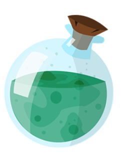
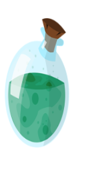
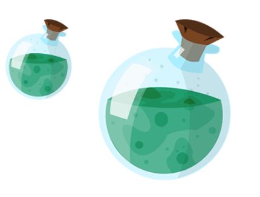
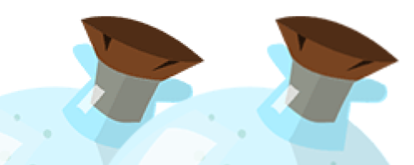
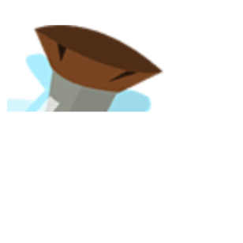
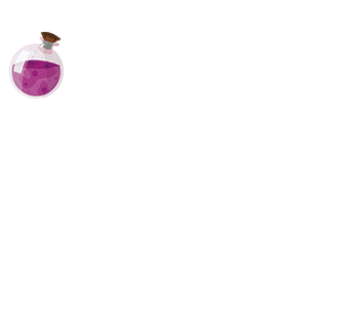
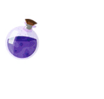
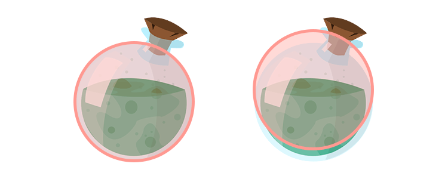
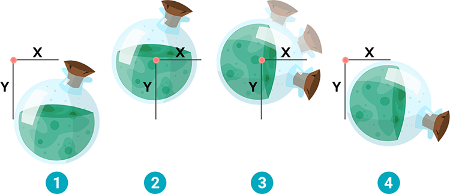
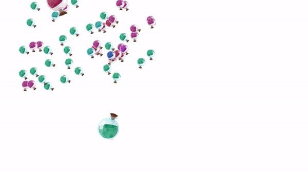

# 2D HTML5 Game Tutorial
## Images and sprite animations

Draw your own images on the canvas and learn how to stretch, scale and rotate them. Use clipping on sprites to create sprite animations. By the end of this tutorial you can draw your own images and animations on the canvas and use them in a game.

> In this tutorial you'll continue to build your HTML5 game, but first there will be a general explanation about how to draw images to the canvas and how to display sprite animations.

### Get a reference to an HTML image element
Before you can start to actually draw an image on the canvas, you'll somehow need to obtain a **reference** to the image you want to draw. There are multiple ways to do this, but in this first example you're going to do it the easy way and reference an image element on a web page.

An **image element** is a HTML container for images. You can create one by using the `````` tag on a web page. You can specify a [source for the image](https://html.com/attributes/img-src/) by using the ```src``` attribute. The browser will load the source and display the image inside the element when loaded. It's what you would normally use to display an image on a web page. You can use the image displayed in the image element, reference it and draw it on your canvas.

To create your own image element, start by adding an `````` Set the ```src``` and ```id``` attributes. You can [download](./img/animation-image-bottle.png) the example image here.

```html

```

The **id** is just [a tag to help you identify the element](https://www.geeksforgeeks.org/html-id-attribute/), it doesn't really do anything on its own. You can reference the id in your JavaScript code. Use ```getElementById()``` and pass the id as argument to get the element holding the image.

```javascript
let img = document.getElementById("myImage");
```

The ```img``` variable now holds a valid reference to an image element. You can use this variable to draw the image on the canvas.

### Draw an image on the canvas
Drawing images on the canvas is pretty straight forward. You can simply use the ```drawImage()``` function on the ```2dContext```.

The function needs a reference to an image and a position. The method header looks like this: ```context.drawImage(img,x,y);``` You've just stored your reference, so all you need is an x and y position. You can use it like this:

```javascript
context.drawImage(img, 10, 30);
```

The ```img``` variable, filled with the reference to your image element, will be drawn on the canvas. In this example it will be drawn on _(10, 30)_. It looks exactly the same as the original image in the image element.



> ### Why isn't the image visible?
> 
> Did you implement every step until now, but you're not seeing an image getting drawn? Or the image is drawn, but only _sometimes_? Good chance its because you're referencing an image element on the page that isn't fully loaded yet.
>
> It takes some time for the image element to have loaded its source. If you reference the element while the source isn't loaded, there is nothing to draw yet. The code on the page is executed before all resources had a chance to fully load.
> 
> You can fix this by using the ```window.onLoad``` event to wait for the page and all its resources to load completely, before referencing and drawing an image element to the canvas. This way you can be sure the image element and the image itself are both present on the page, ready for you to reference it for drawing.
>
> You can implement the ```onLoad``` event by setting a function to serve as [event handler](https://eloquentjavascript.net/15_event.html). When the event fires, the function will be triggered. Here's an example implementation:
> ```javascript
> window.onload = function (){
>   // The page is completely loaded now
>   // You can reference the image element
>   let img = document.getElementById("myImage");
>   context.drawImage(img, 10, 30);
> }
> ```

### Load an image from a URL

You've just learned how to reference images inside image elements present on the page. For a game you can't expect this to work the same. You would be able to see all images and sprites used in the game on the webpage.

You probably want to load images via [a URL](https://www.computerhope.com/jargon/u/url.htm), without them ever having been visible to the user. You can load an image from an URL with JavaScript by defining a new ```Image``` object and setting its ```src``` property. Use the ```onload``` event on the image to start drawing when the image source has loaded.

Here's a simple implementation that draws _yourimage.png_ on (10, 10) on the canvas as soon as it's loaded:

```javascript
let img = new Image();
img.onload = function() {
   context.drawImage(img, 10, 10);
};
img.src = 'https://www.linktoyourimage.com/yourimage.png';
```

### Resize an image
With the ```drawImage()``` method you can easily **stretch and scale** images. Just add _width_ and _height_ to the existing arguments of the function call, like so: ```context.drawImage(img,x,y,width,height);```

Here's an example that stretches the image from before to a size of _100x200_.

```javascript
context.drawImage(img, 10, 30, 100, 200);
```



As you can see, the ratio of the image is changed. The image looks deformed now.

### Scale while preserving the image ratio
To resize the image but keep the [aspect ratio of the image](https://www.shutterstock.com/blog/common-aspect-ratios-photo-image-sizes) the same, you can use the ```width``` and ```height``` properties of the image.

In the next example the image is made twice as small as the original:

```javascript
context.drawImage(img, 10, 30, img.width / 2, img.height / 2);
```
Here's the result, with the original image displayed next to it.



The image is scaled, but no longer deformed. The aspect ratio is maintained and is the same as that of the original image. Just keep in mind you need to scale the _width_ and _height_ by the same amount if you want to preserve the aspect ratio of an image.

### How to fix scaling artifacts?
When scaling an image beyond (or below) its original size you might notice some quality issues. You can see **jagged edges** or other scaling artifacts. Smoothing can help fix this problem and make a scaled image look better.

By default, **image smoothing** is enabled on the canvas. You can manually toggle the smoothing with the ```imageSmoothingEnabled``` [property on the context](https://developer.mozilla.org/en-US/docs/Web/API/CanvasRenderingContext2D/imageSmoothingEnabled). You even have a say in the **smoothing quality**. You can set ```imageSmoothingQuality``` to ```'low'```, ```'medium'``` or ```'high'```, although this option isn't supported by all browsers. Just keep in mind, enabling smoothing or setting it to a high smoothing quality can have its impact on performance.

```javascript
context.imageSmoothingEnabled = true;
context.imageSmoothingQuality = 'high';
context.drawImage(img, 10, 30, img.width * 3, img.height * 3);
```

Here's a quick example. Left is the image without smoothing, right is smoothed. You can clearly see the difference when looking at the edges.



### Draw only a part of an image
Sometimes you only want to draw a small part of the original image. Leaving out a part of the source image is called **clipping**. The ```drawImage()``` function can be extended to support clipping. All you need to do is add a few extra arguments.

First you define the **source rectangle** of the image, then you define the **destination rectangle**. The method header looks like this ```context.drawImage(img,sx,sy,swidth,sheight,x,y,width,height);```. Here's an example implementation:

```javascript
context.drawImage(img, 100, 0, 200, 50, 10, 30, 200, 50);
```

In the example a fragment of the image is picked from (_100, 0_), with a width of _200_ and height of _50_. The fragment is drawn to (_10, 30_), with the same width and height as the source. The result will look like this:


A small part of the source image is drawn. The rest of the image is clipped.

### Clip and resize simultaneously
If you selected a source rectangle for the ```drawImage()``` function that is smaller or larger than the destination, the image is scaled or stretched.

In the next example the destination rectangle is twice the size of the source rectangle. The size of the clipped source is _200x50_, while the size of the destination is _400x100_. The image is clipped and scaled at the same time.

```javascript
context.drawImage(img, 100, 0, 200, 50, 10, 30, 400, 100);
```



As you can see the image is now clipped and drawn twice the size of the previous example.

### Use clipping with sprites
You can use the technique of clipping to display images from [sprite sheets](https://www.codeandweb.com/texturepacker/tutorials/how-to-create-a-sprite-sheet). **Sprites** are collections of images, all merged together on the same source image. It is a technique most commonly used in games to store animations or a set of [assets](https://conceptdevelopmentbendavis.blogspot.com/2009/02/what-are-game-assets.html) in a **single image file**.

Here's an example sprite image, containing 10 frames of an animation:


It's one image, but it consists of many smaller images merged together. Every sub image can be seen as a **frame**. In the example, you see the potion bottle change color a little bit more, every frame. Multiple animation frames can be packed together in one single image this way.

Let's say you want to display the ninth image from the example sprite. You'll need to know it's coordinates first. With sprite animations, it is most common to use the same width and height for every frame inside the sprite. So to display a single image simply keep track of the column and row and multiply it by the width or height of the frame.

Here's an example implementation of how to display the ninth frame from inside the sprite (that's the fourth column, second row):

```javascript
// Define the size of a frame
let frameWidth = 50;
let frameHeight = 61;

// Rows and columns start from 0
let row = 1;
let column = 3;

context.drawImage(sprite, column*frameWidth, row*frameHeight, frameWidth, frameHeight, 10, 30, frameWidth, frameHeight);
```

It will cut out and display only the desired potion bottle. It will look like this:



### Create a sprite animation
In the previous example you've drawn only one image to the canvas. But if you want to create an animation from the sprite, you'll need to display a lot more frames, at a high interval.

To achieve this, you basically keep changing the coordinates of the source rectangle of the sprite image. Draw new images fast enough and you'll have an animation.

Here's an example implementation using an interval to draw a new frame 10 times per second. It's a quick example using **setInterval()** to skip the hassle of having to explain the time stamp again, but of course you would normally merge this code in your game loop and work with the time that has passed between each frame (aka delta time) to decide when to pick a new sprite image.

```javascript
// Define the number of columns and rows in the sprite
let numColumns = 5;
let numRows = 2;

// Define the size of a frame
let frameWidth = sprite.width / numColumns;;
let frameHeight = sprite.height / numRows;;

// The sprite image frame starts from 0
let currentFrame = 0;

setInterval(function()
{
    // Pick a new frame
    currentFrame++;

    // Make the frames loop
    let maxFrame = numColumns * numRows - 1;
    if (currentFrame > maxFrame){
        currentFrame = 0;
    }

    // Update rows and columns
    let column = currentFrame % numColumns;
    let row = Math.floor(currentFrame / numColumns);

    // Clear and draw
    context.clearRect(0, 0, canvas.width, canvas.height);
    context.drawImage(sprite, column * frameWidth, row * frameHeight, frameWidth, frameHeight, 10, 30, frameWidth, frameHeight);

//Wait for next step in the loop
}, 100);
```



Multiple frames of a sprite are drawn in quick succession. The result is an animation of the potion bottle changing color. It's a very basic example to give you a general idea. You can apply the same principles to more complex animation sprites.

> ### Where to get sprites?
> On the web you can find [royalty free game assets](https://www.gameart2d.com/), including sprite sheets. You can try to apply this tutorial on them and create your own animation. You can even take it a step further and [create an animation sprite sheet](https://atomisystems.com/html5-animation/saola-animate-2/create-sprite-sheet-animation-saola-animate/) of your own.

### How do you apply this to your game?

Drawing a single image is fun, but a game needs many more instances. In the previous tutorial you've implemented physics for your game. If you apply the knowledge about sprites to the last game example, you can create something a bit more game-like.

In the old example, simple circles are drawn to the canvas. Let's replace them with an actual image. And remember the collisions? For every collision, the image will take the next frame of the sprite. Here's what you'll get:


Colliding potions that change color? This is one weird example, but hopefully it helps to demonstrate a more practical use of sprites. Adding images makes it look more like an actual game. To achieve this example, you'll need to take the next steps:
* Load the desired image (not more than once)
* Update the current animation frame for every collision
* Draw the right section of the sprite in the ```draw()``` function

Your ```Circle``` class will look something like this:

```javascript
class Circle extends GameObject
{
    // Define the number of columns and rows in the sprite
    static numColumns = 5;
    static numRows = 2;
    static frameWidth = 0;
    static frameHeight = 0;
    static sprite;

    constructor (context, x, y, vx, vy, mass)
    {
        // Pass params to super class
        super(context, x, y, vx, vy, mass);

        // Set the size of the hitbox
        this.radius = 10;

        // Supply the sprite. Only load it once and reuse it
        loadImage();
    }

    loadImage()
    {
        // Check for an existing image
        if (!Circle.sprite)
        {
            // No image found, create a new element
            Circle.sprite = new Image();

            // Handle a successful load
            Circle.sprite.onload = () =>
            {
                // Define the size of a frame
                Circle.frameWidth = Circle.sprite.width / Circle.numColumns;
                Circle.frameHeight = Circle.sprite.height / Circle.numRows;
            };

            // Start loading the image
            Circle.sprite.src = '/path-to/your-sprite-image.png';
        }
    }

    draw()
    {
        // Limit the maximum frame
        let maxFrame = Circle.numColumns * Circle.numRows - 1;
        if (this.currentFrame > maxFrame){
            this.currentFrame = maxFrame;
        }

        // Update rows and columns
        let column = this.currentFrame % Circle.numColumns;
        let row = Math.floor(this.currentFrame / Circle.numColumns);

        // Draw the image
        this.context.drawImage(Circle.sprite, column * Circle.frameWidth, row * Circle.frameHeight, Circle.frameWidth, Circle.frameHeight, (this.x - this.radius), (this.y - this.radius) - this.radius * 0.4, this.radius * 2, this.radius * 2.42);
    }

    handleCollision()
    {
        // Pick the next frame of the animation
        this.currentFrame++;
    }

    update(secondsPassed)
    {
        // Move with velocity x/y
        this.x += this.vx * secondsPassed;
        this.y += this.vy * secondsPassed;
    }
}
```

### Practical use of hitboxes

As you can notice in the code of the previous example, there is a small offset in the drawing position of the image. It's at the end of this line:

```javascript
// Draw the image
this.context.drawImage(Circle.sprite, column * Circle.frameWidth, row * Circle.frameHeight, Circle.frameWidth, Circle.frameHeight, this.x - this.radius, this.y - this.radius * 1.42, this.radius * 2, this.radius * 2.42);

// The y-offset is 42% of the radius. When radius = 10px, entire bottle = 20px, neck = 4.2px
// To maintain the image aspect ratio, the height is 21% larger than the width (2.42 vs 2 times the radius)
// You can calculate it by dividing the image height by image width. You could automate it further.
```

The offset is there to make sure the body of the potion bottle exactly covers the circle used for **collision detection**. The image below illustrates the difference between using the offset (on the left) and just keeping the hitbox centered (on the right).



As explained in the previous tutorial, many games use this method of using a simple shape (a circle in this case) as a hitbox for a more complex one (the potion bottle, with an irregular round shape). There is a small flaw however. The neck of the bottle doesn't trigger a collision because it has no hitbox, it sticks out of the circle. If that's a problem for your game, try to use a different or more complex hitbox. Maybe a rectangle shape or perhaps a combination of a rectangle and a circle.

You can always draw the hitbox on screen to see how you're doing:

```javascript
this.context.beginPath();
this.context.arc(this.x, this.y, this.radius, 0, 2 * Math.PI);
this.context.fill();
```

### Rotating images on the canvas

The use of sprites in the last game example made things look better, but the movement of the items isn't very realistic. The image orientation stays the same, no matter the direction of the objects. It would be more natural if the orientation matches the direction.

You can achieve this effect by rotating images on the canvas. To start rotating, you'll first need to use the speed of the object to calculate the angle of rotation. You can do this in your ```update()``` function, and keep the angle of objects up-to-date automatically. Here's an example:

```javascript
update(secondsPassed)
{
    // Move with velocity x/y
    this.x += this.vx * secondsPassed;
    this.y += this.vy * secondsPassed;

    // Calculate the angle
    let radians = Math.atan2(this.vy, this.vx);
    this.angle = 180 * radians / Math.PI;
}
```

When you have the angle, you'll need to make some small adjustments to the ```draw()``` function in the ```Circle``` class. Replace the single line with the original call to ```drawImage()``` with this block of code:

```javascript
// Set the origin to the center of the circle, rotate the context, move the origin back
this.context.translate(this.x, this.y);
this.context.rotate(Math.PI / 180 * (this.angle + 90));
this.context.translate(-this.x, -this.y);

// Draw the image, rotated
this.context.drawImage(Circle.image, this.column * Circle.frameWidth, this.row * Circle.frameHeight, Circle.frameWidth, Circle.frameHeight, (this.x - this.radius), (this.y - this.radius) - this.radius * 0.4, this.radius * 2, this.radius * 2.42);

// Reset transformation matrix
this.context.setTransform(1, 0, 0, 1, 0, 0);
```

Let's explain this some more. You can change the way items are drawn to the canvas by setting a **transformation matrix**. It's basically a sort of filter that's applied to every **drawing operation**. There are multiple functions to help you manipulate it. The one you need right now to add a rotation to the matrix is the ```rotate()``` function. But using it will apply a rotation around the **top left corner** and this will make the image position to be off.

To correct way of doing this is by adding a rotation around the **center of the image**. You need to manually set the **pivot point** to make this happen. This can be done by calling the ```translate()``` function before doing the rotation.

You can think of it as a way to move the canvas so the **origin** of the x and y axis is placed in the center of the image you want to rotate. When you rotate now, the image will rotate around its own center. After that, the canvas is translated back to its original position. The origin is now back to (_0,0_) and the transformation matrix contains a rotation. That's all happening in the first tree lines of the code block.

> Rotating an image around its center point
> 
> The image above visualizes the rotating process. It consists of 4 steps.
> * **Step 1** - Use the original transformation matrix. The image will be drawn at the origin.
> * **Step 2** - Add a translation to the matrix. It will align the image center directly with the origin.
> * **Step 3** - Add a rotation to the matrix. The image will be rotated with the origin as pivot point.
> * **Step 4** - Revert the translation. The image will be drawn on its original position, but rotated this time.

After that, you can draw an image like you're used to. Only this time the matrix will change the output. It doesn't matter if the image is clipped or not, it even works for the animation sprites.

When you're done drawing, the context needs to be **restored**. Otherwise, it will stay in rotated position and every next draw to the canvas will be rotated too. That's where ```setTransform()``` comes in.

In this case, it's used to nullify the **transformation matrix**  the rotation and restores the matrix to its original state. As an alternative, you can also sandwich the code between ```context.save()``` and ```context.restore()``` calls, but ```setTransform()``` performs [way better](https://stackoverflow.com/questions/38069462/html5-canvas-save-and-restore-performance/38079796) for this example.

This is what you get when you run the code. It's a more natural view of the moving objects!


