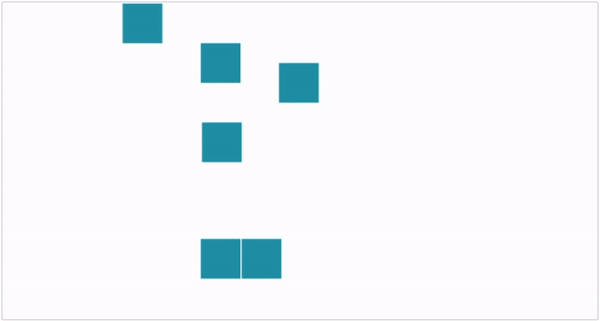
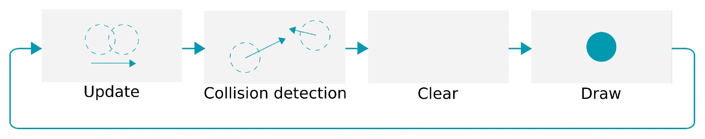
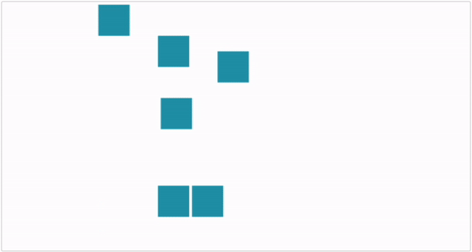
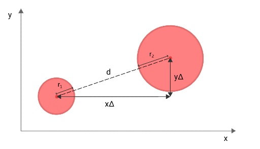
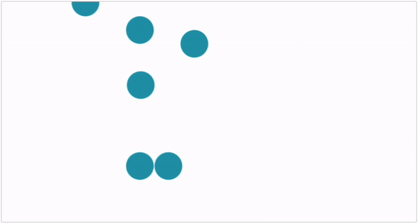
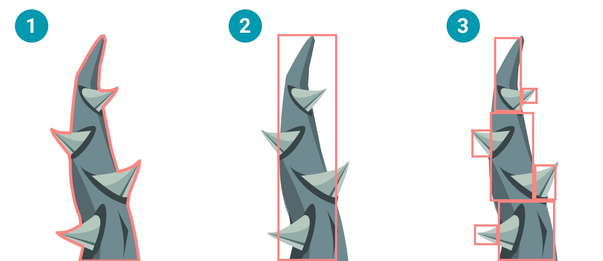
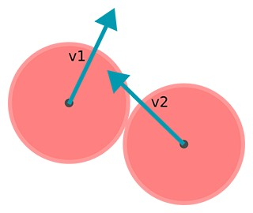
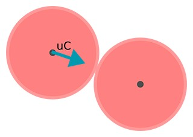

# 2D HTML5 Game Tutorial
## Collision detection and physics
Perform collision detection and react with physics, using JavaScript. Check for overlap between shapes, apply hitboxes and calculate new velocities. Make it more natural with object mass, gravity and restitution. By the end of this tutorial, you'll have a basic physics simulation running in your game.

### Create some moving objects
Before you can detect collisions between moving objects, you'll need some objects to begin with. In the previous tutorial you've learned how to move a single rectangle. Let's expand that logic and create a whole bunch of moving objects to fill your game. First, define a new type of game object. It's going to be a simple square.

```javascript
class Square extends GameObject
{
    constructor (context, x, y, vx, vy){
        super(context, x, y, vx, vy);

        // Set default width and height
        this.width = 50;
        this.height = 50;
    }

    draw(){
        // Draw a simple square
        this.context.fillStyle = this.isColliding?'#ff8080':'#0099b0';
        this.context.fillRect(this.x, this.y, this.width, this.height);
    }

    update(secondsPassed){
        // Move with set velocity
        this.x += this.vx * secondsPassed;
        this.y += this.vy * secondsPassed;
    }
}
```
This code might look a bit familiar. There is a draw() and a update() function, just like in the previous tutorial. Only this time it is baked into a separate square [class](https://javascript.info/class). This way you can create many instances of a square and they all use the same logic to draw and update. You'll have the behavior and looks of the square in one, easy-to-manage, place.

The ```fillStyle``` in this new class is tweaked a bit. When this object is colliding, it will change color from blue to red. You'll see this in action when the first collisions are detected. For now, all squares will be blue.

All the squares **inherit** from the ```GameObject``` class. Every game object has a position and a speed. This enables you to easily create new types of game objects. They [inherit](https://javascript.info/class-inheritance) the attributes and methods of the ```GameObject``` class. The square is just an example, but you could also make objects like enemies or players for your game this way.

```javascript
class GameObject
{
    constructor (context, x, y, vx, vy){
        this.context = context;
        this.x = x;
        this.y = y;
        this.vx = vx;
        this.vy = vy;

        this.isColliding = false;
    }
}
```

You can create a [new](https://developer.mozilla.org/en-US/docs/Web/JavaScript/Reference/Operators/new) instance of a class by using the new keyword. Make some squares to fill up your game world using this ```createWorld()``` function.

```javascript
let gameObjects;

function createWorld(){
    gameObjects = [
        new Square(context, 250, 50, 0, 50),
        new Square(context, 250, 300, 0, -50),
        new Square(context, 150, 0, 50, 50),
        new Square(context, 250, 150, 50, 50),
        new Square(context, 350, 75, -50, 50),
        new Square(context, 300, 300, 50, -50)
    ];
}
```

In the function, a bunch of squares are created. They are passed a position and speed as arguments. For now, this function is very static, but you could easily modify it to create more random squares or use some **spawning algorithm**.

Everything is in place to draw squares now. Update your game loop with the following code to loop over the newly created game objects and draw them on the screen.

```javascript
function gameLoop(timeStamp)
{
    secondsPassed = (timeStamp - oldTimeStamp) / 1000;
    oldTimeStamp = timeStamp;

    // Loop over all game objects
    for (let i = 0; i < gameObjects.length; i++) {
        gameObjects[i].update(secondsPassed);
    }

    clearCanvas();

    // Do the same to draw
    for (let i = 0; i < gameObjects.length; i++) {
        gameObjects[i].draw();
    }

    window.requestAnimationFrame(gameLoop);
}
```

As you can see, ```update()``` and ```draw()``` are no longer just called once per iteration. There are called once for every object on screen, every iteration.

This way the implementation of ```update()``` and ```draw()``` is **object-specific**. For the game loop it doesn't matter what kind of objects you are trying to draw, as long as they have an ```update()``` and ```draw()``` function.

For the square you are using, it will draw a simple square and move it in a straight line. But imagine other types of objects who have their own implementation of the two functions and have behavior and looks of their own. This game loop can handle it.

By the way, did you notice the ```use strict``` line missing in these new classes? That's because classes defined with the class keyword are strict by default. So, there is no need to specifically add ```use strict``` in these classes.

Take a look at the result:



You can see a bunch of rectangles getting drawn now. They each have their own starting position and move in a different direction. Just as defined in the ```createWorld()``` function. You can tweak the variables to create new types of squares.

### Why do you need collision detection?
The squares may overlap in their movement, but that doesn't do much for now. It would be cool if the squares could interact and behave like actual **solid objects** and bounce off of each other.  make this happen, they would have to start with knowing they're colliding with one another. That's where **collision detection** comes in.

Collision detection is the art of detecting if two objects are colliding with each other, or did so between now and the last frame. It's the first step of implementing physics in your game.

### Check for collisions between objects
The squares are moving on the screen, but there is no form of interaction jet. It's like they don't notice each other. Let's do something about that.

You are going to check for collisions between the moving objects. That requires you to loop over all objects and check if any of them overlaps with another. You'll need a [nested for loop](https://www.educba.com/nested-loop-in-javascript/) for this.

```javascript
function detectCollisions(){
    let obj1;
    let obj2;

    // Reset collision state of all objects
    for (let i = 0; i < gameObjects.length; i++) {
        gameObjects[i].isColliding = false;
    }

    // Start checking for collisions
    for (let i = 0; i < gameObjects.length; i++)
    {
        obj1 = gameObjects[i];
        for (let j = i + 1; j < gameObjects.length; j++)
        {
            obj2 = gameObjects[j];

            // Compare object1 with object2
            if (rectIntersect(obj1.x, obj1.y, obj1.width, obj1.height, obj2.x, obj2.y, obj2.width, obj2.height)){
                obj1.isColliding = true;
                obj2.isColliding = true;
            }
        }
    }
}
```

All objects are checked for intersection with each other. The second for loop is a bit smarter and skips all previous checked items. You don't have to check objects twice. If they overlap the first time, they will too the second time. And of course, you don't have to check an object against itself, it would always overlap.

The function calls ```rectIntersect()``` for every combination of objects. When it finds a collision, it sets ```isColliding``` to true for both objects involved.

Remember the ```draw()``` function from the square? It will react to ```isColliding``` and draw the square in a different color. You can easily see when two objects overlap.

### When do you check for collisions?
Just as with the draw() method, you want to update the position of all your game objects first, before checking for collisions. This way you'll always check for overlapping objects in their **most recent state**. If you do it the other way around and check for collisions before updating, you'll be checking for overlap on the state of the previous frame. You'll always run behind the facts.

Another option would be to do the collision check in the right order, but iterative. You would update object-a, check object-a for overlap with all other objects, update object-b, check object-b for overlap with all other objects, and so on. This is also an incorrect way of doing a collision check. Imagine object-a would be in collision with object-b after updating object-a's position. The system would detect a collision, even though it might not have been the case when object-b would have moved first too. That's why you'll always have to update all objects, before doing a collision check.

The correct order for your game loop is, **update**, **collision check**, **clear canvas**, **draw**. So, place the ```detectCollisions()``` function right after the loop for updating all game objects. Your total game loop now looks like this:



### Collision detection between rectangles
The last piece of the puzzle is the ```rectIntersect()``` method. You can use it to check if two rectangles overlap. Checking for overlap between two **axis-aligned** (unrotated) rectangles is pretty simple and straight forward. You can probably come up with a method of checking for overlap on both axis by using the position and size of the rectangles. There are a lot of ways to do this, but the next method is very efficient:

```javascript
rectIntersect(x1, y1, w1, h1, x2, y2, w2, h2) {
    // Check x and y for overlap
    if (x2 > w1 + x1 || x1 > w2 + x2 || y2 > h1 + y1 || y1 > h2 + y2){
        return false;
    }
    return true;
}
```

The code detects rectangles clearly overlapping halfway, but also works in the case of one small rectangle falling completely in a large one.<br>
With this piece of code in place, you can finally check out the result. Here are the squares again, but this time they react upon each other.



After detecting a collision, the ```isColliding``` attribute is set to true. This makes the squares draw in red. You can clearly see when two objects overlap now.

### Check if two circles overlap
You have a method now for checking collision between unrotated rectangles. But what if you want to do the same for circles? Well, that's not that hard either.

Imagine you have two circles, each with their own radius. They are placed with a distance between them. The circles would overlap if the **distance is smaller** than the **sum of the radius** of both circles. Since circles are round, this would even work when rotating the objects, they don't have to be axis-aligned.



> Calculate distance between two points<br>
> You can calculate the distance between two points with the following formula:<br>
> c = sqrt((x1 - x2)2 + (y1 - y2)2)<br>
> If you think of Δx and Δy as two sides of a triangle, it basically applies the [Pythagorean theorem](https://en.wikipedia.org/wiki/Pythagorean_theorem) to compute the size of the straight line between the points, c, the distance.

So, if this distance is smaller than or equal to the radius of circle-a plus circle-b, the circles overlap or touch. This principle is used in the next function:
```javascript
circleIntersect(x1, y1, r1, x2, y2, r2) {

    // Calculate the distance between the two circles
    let squareDistance = (x1-x2)*(x1-x2) + (y1-y2)*(y1-y2);

    // When the distance is smaller or equal to the sum
    // of the two radius, the circles touch or overlap
    return squareDistance <= ((r1 + r2) * (r1 + r2))
}
```
As you can see, the formula is tweaked a bit. Multiplication is much faster than getting the square root with ```Math.sqrt()```,  the distance is calculated without getting the root and the sum of the radii is multiplied by itself. The outcome stays the same, but the performance is better.

Here is the same example as before, but with circles this time:



### What about other shapes?
In this article, collision detection is only covered for two types of shapes. But what if your game objects consist of other, more complex, shapes or even images and you want to perform collision checks between them?

Well, for geometric shapes you can find other formulas to detect when two objects overlap. Here's a website who covers [collision detection for a lot of different shapes](http://www.jeffreythompson.org/collision-detection/table_of_contents.php). Overall, more complex shapes make collision detection more difficult. And for images you could apply **pixel perfect** collision detection. The downside of this is that it's a super CPU-heavy operation. Imagine having to match every pixel with one another, it would be a heck of a job.

That's why, to make things easier and put less stress on your system, developers often use **hitboxes** to detect collisions between complexly shaped game objects. It's a way to make collision detection easier and uses only basic geometric shapes, like the rectangles and circles covered in this tutorial. So, before you start building support for all kinds of complex shapes, try to think of a simple way to achieve the same effect, with basic shapes and hitboxes.

### What are hitboxes and how do you use them?
Hitboxes are imaginary geometric shapes around game objects that are used to determine collision detection. Imagine you have a player figure. You won't check its arms and legs for collision but instead just check a big imaginary rectangle that's placed around the player.

You could simply use the function for rectangle collision detection, you've applied before, to check the hitboxes for collisions. It's far less CPU-intensive and makes supporting complex shapes in your game much easier. In some special cases, you could even use multiple hitboxes per game object. It would still outperform the pixel perfect solution.



The image above demonstrates the different types of collision detection. They each have their own advantages and disadvantages:
1. **Pixel perfect** - Super precise collision detection, but it requires some serious system resources. In most cases this is an overkill.
2. **Hitbox** - Much better performance, but the collision detection can be pretty imprecise. In many game scenarios though, this doesn't really matter.
3. **Multiple hitboxes** - Less efficient than a single hitbox but it still outperforms the pixel perfect variant. And you can support complex shapes. This is a nice option to use for important game objects that need some extra precision, like the player with limbs like mentioned before. You could make a hitbox for the core and separates ones for arms, legs and the head.

### React to collisions with physics
You now have game objects who can detect a collision and change color. But wouldn't it be much cooler if the objects bounce off on each other, like real life objects? It's time to apply some **physics** to your game.

To change the **velocity** of the moving objects, you'll need to find out in what **direction** and with what **speed** the collision took place. You can then apply a change in velocity to the collided objects. The principles behind this work for both rectangles and circles.

### Find the direction and speed of the collision
Imagine the next collision between two game objects. Both objects have a speed and direction of their own. They don't hit each other exactly straight on, but just happen to cause a collision while moving on their own course.



You'll want to find out the speed and direction of the collision so you can apply it to the velocity of the game objects. Start by creating a **vector** for the collision that took place. This vector is nothing more than the difference in x and y between the two colliding objects. You can see it as an arrow with **length** and **direction**. With vectors, the length is also called [magnitude](https://onlinemschool.com/math/library/vector/length/). Calculate the collision vector like this:
```javascript
let vCollision = {x: obj2.x - obj1.x, y: obj2.y - obj1.y};
```

In the example of the two game objects, the collision vector will look like this:


The magnitude in this case, is equal to the distance between the two colliding objects. It has nothing to do with speed yet. But you can use the direction of the vector. To get to the direction, you need to take away the factor of the distance.

Let's first calculate the **distance** of the collision vector. You can use the same formula as you did before to calculate the distance between two colliding circles. So the code becomes:

```javascript
let distance = Math.sqrt((obj2.x-obj1.x)*(obj2.x-obj1.x) + (obj2.y-obj1.y)*(obj2.y-obj1.y));
```

Now use the distance to compute a **normalized collision vector**. You basically remove the distance as a factor in the collision vector, so you are left with just a direction. The collision norm is in the same direction as the collision vector, only with norm/magnitude/length 1. You also call this an [unit vector](https://mathworld.wolfram.com/UnitVector.html). You can calculate the normalized vector like this:
```javascript
let vCollisionNorm = {x: vCollision.x / distance, y: vCollision.y / distance};
```

This will basically leave you with just a direction for the collision. In the example of the two game objects, it will look like this:


You now have a **direction**. This is the direction in which the collision took place. All you need now is the collision **speed** and you'll be able to calculate how the velocity of the objects will be affected by the collision. You can calculate the speed of the collision like this:

```javascript
let vRelativeVelocity = {x: obj1.vx - obj2.vx, y: obj1.vy - obj2.vy};
let speed = vRelativeVelocity.x * vCollisionNorm.x + vRelativeVelocity.y * vCollisionNorm.y;
```

As first row in the example code, another vector is created with the relative velocity of the objects. It's like the vector you would have left if you would make one of the game objects stationary. (You can read more about [relative velocities](https://www.schoolphysics.co.uk/age16-19/Mechanics/Kinematics/text/Relative_velocity/index.html) here.) It's easier to understand in the next example. The vectors of the two game objects are displayed on top of each other, so you can visualize the **relative velocity vector**:
