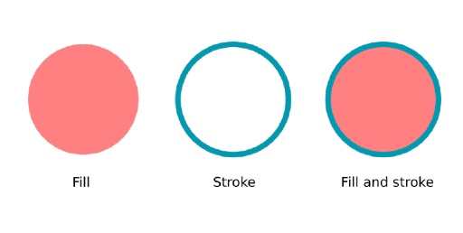

# 2D HTML5 Game Tutorial
## DRAW SHAPES, PATHS AND TEXT

Draw graphics on the HTML5 canvas using shapes and paths. Create rectangles, circles, lines, triangles and more complex shapes using SVG paths. By the end of this tutorial you can draw your own graphics and text on the canvas.

### Draw shapes with paths
The ```CanvasRenderingContext2D``` only supports two primitive shapes, rectangles and paths. You could use the rectangle to draw a square, by making a rectangle with even sides. But if you want to draw anything else, like a triangle or circle, you'll have to use a path.
* Rectangles - Rectangles and squares
* Paths - Circles, lines, triangles and many other shapes

Paths start by calling beginPath() on the context (this will clear the context of any existing paths). You then define the shape of your path. This can be a circle or a line for example. After defining the path, you can call ```fill()``` or ```stroke()``` to draw the path to the canvas.

### How to draw a circle?
The next code demonstrates how to draw a circle. You can see it begins by starting a new path with the ```beginPath()``` function and ends with ```fill()``` to draw the path to the canvas.
```javascript
context.beginPath();
context.arc(200, 100, 50, 0, 2 * Math.PI);
context.fill();
```


The ```arc()``` function is the one who defines an [arc-shaped](https://www.mathopenref.com/arc.html) path, in this case a full circle. It works like this:
* The first two arguments are the **x** and **y** of the center of the circle.
* The third is the **radius** of the circle. A larger radius will make for a larger circle.
* The last two arguments are the **starting angle** and **ending angle** of the arc in radians. This example circle starts at an angle of zero and ends at an angle of two times pie, making a perfect circle.

### How to draw a basic line?
Another basic path action is that of drawing a line. It is done by calling the ```lineTo()``` function.
```javascript
context.beginPath();
context.moveTo(50, 50);
context.lineTo(250, 150);
context.stroke();
```


Drawing a line starts again with calling ```beginPath()``` to mark the start of a new path. The next call to ```moveTo()``` is telling the context where to start drawing the path on your canvas. It doesn't really draw anything on its own, it only tells on which coordinates to start. From there you can draw a line with the ```lineTo()``` function.<br>
When you have completed your path, consisting of just a line in this case, you can call ```stroke()``` to stroke the path and actually make it visible. ```fill()``` wouldn't work here since the path only consists of a single line and has no real surface.

### And what about a triangle?
By using multiple commands you can draw up more complex shapes. This enables you to create a triangle by working with multiple separate lines.
```javascript
context.beginPath();
context.moveTo(200, 100);
context.lineTo(250, 150);
context.lineTo(250, 50);
context.fill();
```


The code for a triangle is almost similar to that of a separate line, only this time ```lineTo()``` is called multiple times.<br>
Notice how ```lineTo()``` is called only twice, but you need three lines for a triangle. The last line is drawn automatically when you call ```fill()```. It closes the path and connects start to end.<br>
By stacking multiple commands after calling the ```beginPath()``` function you can create almost any desired shape.

### The difference between using fill and stroke
You have been using ```fill()``` and ```stroke()``` to draw on the canvas. But what exactly is the difference between those ways of drawing?<br>
When using a **fill** it is like you color the **surface** of a shape. It is completely filled with color. When using a **stroke**, you only draw the **outline** of an shape. The center of your path can still be empty.<br>
You can mix up fill and stroke to create more complex graphics. Here's a simple overview on the difference between fill and stroke:<br>

