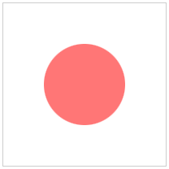
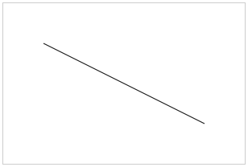
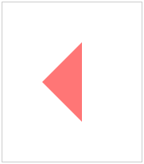
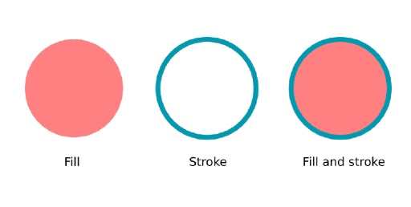
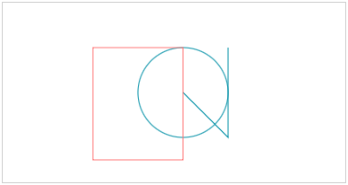
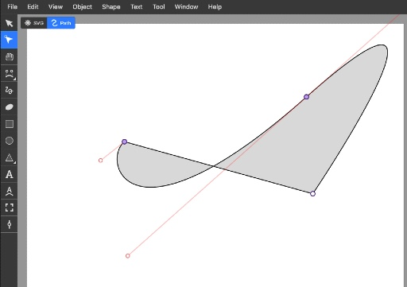
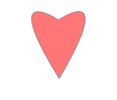
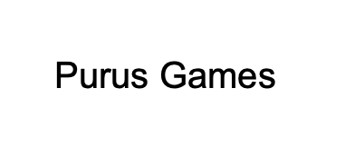

# 2D HTML5 Game Tutorial
## Draw shapes, paths and texts

Draw graphics on the HTML5 canvas using shapes and paths. Create rectangles, circles, lines, triangles and more complex shapes using SVG paths. By the end of this tutorial you can draw your own graphics and text on the canvas.

### Draw shapes with paths
The ```CanvasRenderingContext2D``` only supports two primitive shapes, rectangles and paths. You could use the rectangle to draw a square, by making a rectangle with even sides. But if you want to draw anything else, like a triangle or circle, you'll have to use a path.
* Rectangles - Rectangles and squares
* Paths - Circles, lines, triangles and many other shapes

Paths start by calling beginPath() on the context (this will clear the context of any existing paths). You then define the shape of your path. This can be a circle or a line for example. After defining the path, you can call ```fill()``` or ```stroke()``` to draw the path to the canvas.

### How to draw a circle?
The next code demonstrates how to draw a circle. You can see it begins by starting a new path with the ```beginPath()``` function and ends with ```fill()``` to draw the path to the canvas.
```javascript
context.beginPath();
context.arc(200, 100, 50, 0, 2 * Math.PI);
context.fill();
```


The ```arc()``` function is the one who defines an [arc-shaped](https://www.mathopenref.com/arc.html) path, in this case a full circle. It works like this:
* The first two arguments are the **x** and **y** of the center of the circle.
* The third is the **radius** of the circle. A larger radius will make for a larger circle.
* The last two arguments are the **starting angle** and **ending angle** of the arc in radians. This example circle starts at an angle of zero and ends at an angle of two times pie, making a perfect circle.

### How to draw a basic line?
Another basic path action is that of drawing a line. It is done by calling the ```lineTo()``` function.
```javascript
context.beginPath();
context.moveTo(50, 50);
context.lineTo(250, 150);
context.stroke();
```


Drawing a line starts again with calling ```beginPath()``` to mark the start of a new path. The next call to ```moveTo()``` is telling the context where to start drawing the path on your canvas. It doesn't really draw anything on its own, it only tells on which coordinates to start. From there you can draw a line with the ```lineTo()``` function.<br>

When you have completed your path, consisting of just a line in this case, you can call ```stroke()``` to stroke the path and actually make it visible. ```fill()``` wouldn't work here since the path only consists of a single line and has no real surface.

### And what about a triangle?
By using multiple commands you can draw up more complex shapes. This enables you to create a triangle by working with multiple separate lines.
```javascript
context.beginPath();
context.moveTo(200, 100);
context.lineTo(250, 150);
context.lineTo(250, 50);
context.fill();
```


The code for a triangle is almost similar to that of a separate line, only this time ```lineTo()``` is called multiple times.<br>
Notice how ```lineTo()``` is called only twice, but you need three lines for a triangle. The last line is drawn automatically when you call ```fill()```. It closes the path and connects start to end.<br>
By stacking multiple commands after calling the ```beginPath()``` function you can create almost any desired shape.

### The difference between using fill and stroke
You have been using ```fill()``` and ```stroke()``` to draw on the canvas. But what exactly is the difference between those ways of drawing?<br>
When using a **fill** it is like you color the **surface** of a shape. It is completely filled with color. When using a **stroke**, you only draw the **outline** of an shape. The center of your path can still be empty.<br>
You can mix up fill and stroke to create more complex graphics. Here's a simple overview on the difference between fill and stroke:<br>


### Stroking paths and shapes and set the color
Here is an example of previously used paths and shapes that are stroked, not filled.
```javascript
context.beginPath();
context.arc(200, 100, 50, 0, 2 * Math.PI);
context.strokeStyle = '#0099b0';
context.stroke();

context.beginPath();
context.moveTo(200, 100);
context.lineTo(250, 150);
context.lineTo(250, 50);
context.stroke();

context.strokeStyle = '#ff8080';
context.strokeRect(100, 50, 100, 125);
```


As you can see ```fill()``` and ```fillRect()``` have their counterparts ```stroke()``` and ```strokeRect()```. There even is a ```strokeStyle``` attribute just like ```fillStyle```.
```javascript
// Example: set stroke color and stroke
context.strokeStyle = '#ff8080';
context.stroke();

// Example: set fill color and fill
context.fillStyle = '#0099b0';
context.fill();
```
If you want to create a thicker line for the stroke, you can use the lineWidth property:
```javascript
context.lineWidth = 5;
```
In the example the circle is drawn in blue, then the triangle is drawn without specifying a specific color and then the rectangle is drawn in red. Since the context stores the fill and stroke style, the triangle is drawn in blue too, without specifying this specifically.<br>

And there is another notable thing happening here. The triangle is not so much a real triangle. It is more like a rotated L-shape. That's because unlike the fill() command, stroke() doesn't tie the beginning of the path to the end. If you need a stroke of a triangle you'll have to specify three lines, not two.

### Draw an SVG path to the canvas
You can stack multiple drawing operations to create complex graphics. But what if the graphics are so complex that drawing operations on the context don't cut it anymore? In those cases you can use **SVG paths**.<br>

[SVG](https://www.sitepoint.com/svg-101-what-is-svg/), or **scalable vector graphics**, contain a detailed explanation of an graphic. But instead of describing pixels, like ordinary images, they describe lines and curves. Just like the paths you are creating for the canvas. The big advantages of using vector graphics is that they can be scaled without limit. Unlike regular pixel images, they don't lose quality.

You can find SVG files online or create your own with vector drawing software like [Illustrator](https://www.adobe.com/products/illustrator.html) or [Inkscape](https://inkscape.org). Here's an example of creating a path with the Inkscape editor.<br>


Inside those SVG files you can find path information. It's actually pretty fun to check it out. It's just a long array of points with moves and curves.<br>
Here's an example of a small part of the inside of a simple SVG file. You can just open it with a text editor.
```xml
<svg width="210mm" height="297mm" viewBox="0 0 210 297" version="1.1" id="svg1" inkscape:version="1.3.2 (091e20e, 2023-11-25)" sodipodi:docname="drawing.svg" xmlns:inkscape="http://www.inkscape.org/namespaces/inkscape" xmlns:sodipodi="http://sodipodi.sourceforge.net/DTD/sodipodi-0.dtd" xmlns="http://www.w3.org/2000/svg" xmlns:svg="http://www.w3.org/2000/svg">
    <path style="fill:#ef5e5e;stroke-width:0.264583" d="M 104.22331,133.37668 C -1.5072094,-35.219492 103.13006,33.890796 103.13006,33.890796 c 0,0 101.73939,-69.935966 1.09325,99.485884 z" id="path1" />
</svg>
```
You can copy the path from the file and use it in your JavaScript code like this:
```javascript
let path = new Path2D('M 104.22331,133.37668 C -1.5072094,-35.219492 103.13006,33.890796 103.13006,33.890796 c 0,0 101.73939,-69.935966 1.09325,99.485884 z');

context.beginPath();
context.strokeStyle = '#0099b0';
context.fillStyle = '#ff8080';
context.stroke(path);
context.fill(path);
```



The path describes exactly what the **heart** looks like. By passing the path as a argument for the ```stroke()``` and ```fill()``` functions it is drawn on the canvas. This is just an example, you could use much more [complex SVG paths](https://www.flaticon.com) and draw them as a shape.

### Draw your own text
Aside from shapes and paths you can also draw text on the canvas. This operation also works with a fill and stroke style, just like any other drawing operation. To draw a simple line of text, use the ```fillText()``` function. It takes text and x and y coordinates as arguments.
```javascript
context.fillStyle = 'black';
context.fillText("Purus Games", 300, 100);
```
You can set the font and text alignment and baseline on the context. The ```font``` property uses the same syntax as the [CSS font property](https://www.w3schools.com/cssref/pr_font_font.php). The ```textAlign``` property is a bit tricky. It marks on which side the text is aligned with the given coordinates. So a ```textAlign = 'right'``` will display the text left of the coordinates you gave up. Not right. The same is true for the ```textBaseline```. A ```textBaseline = 'bottom'``` will display the text above the baseline.
```javascript
context.font = '40px Arial';
context.textAlign = 'right';
context.textBaseline = 'bottom';
```
Here's an example of text drawn on the canvas:


