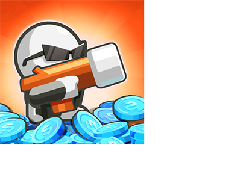
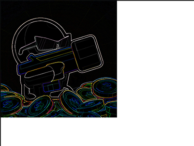
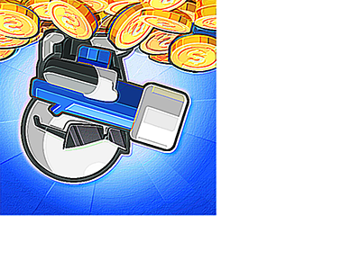

# 2D WebGL Game Tutorial

## WebGL Image Processing

To draw images in WebGL we need to use textures. Similarly to the way WebGL expects clip space coordinates when rendering instead of pixels, WebGL expects texture coordinates when reading a texture. Texture coordinates go from 0.0 to 1.0 no matter the dimensions of the texture.

Since we are only drawing a single rectangle (well, 2 triangles) we need to tell WebGL which place in the texture each point in the rectangle corresponds to. We'll pass this information from the vertex shader to the fragment shader using a special kind of variable called a 'varying'. It's called a varying because it varies. WebGL will interpolate the values we provide in the vertex shader as it draws each pixel using the fragment shader.

Using the [vertex shader from the end of the previous lesson](./webgl-funamentals.md) we need to add an attribute to pass in texture coordinates and then pass those on to the fragment shader.

```javascript
attribute vec2 a_texCoord;
...
varying vec2 v_texCoord;
 
void main() {
   ...
   // pass the texCoord to the fragment shader
   // The GPU will interpolate this value between points
   v_texCoord = a_texCoord;
}
```

Then we supply a fragment shader to look up colors from the texture.

```javascript
precision mediump float;
 
// our texture
uniform sampler2D u_image;
 
// the texCoords passed in from the vertex shader.
varying vec2 v_texCoord;
 
void main() {
   // Look up a color from the texture.
   gl_FragColor = texture2D(u_image, v_texCoord);
}
```

Finally, we need to load [Mr Survivor image](./img/mr-survivor.jpg), create a texture and copy the image into the texture. Because we are in a browser images load asynchronously so we have to re-arrange our code a little to wait for the texture to load. Once it loads we'll draw it.

```javascript
var image = new Image();
image.src = "./mr-survivor.jpg";
image.onload = function() {
    render(image);
}
 
function render(image) {
    ...
    var texcoordLocation = gl.getAttribLocation(program, "a_texCoord");
    
    // Create a buffer to put three 2d clip space points in
    var positionBuffer = gl.createBuffer();
    gl.bindBuffer(gl.ARRAY_BUFFER, positionBuffer);

    setRectangle(gl, 0, 0, image.width, image.height);


    // Create a texture.
    var texture = gl.createTexture();
    gl.bindTexture(gl.TEXTURE_2D, texture);

    // Set the parameters so we can render any size image.
    gl.texParameteri(gl.TEXTURE_2D, gl.TEXTURE_WRAP_S, gl.CLAMP_TO_EDGE);
    gl.texParameteri(gl.TEXTURE_2D, gl.TEXTURE_WRAP_T, gl.CLAMP_TO_EDGE);
    gl.texParameteri(gl.TEXTURE_2D, gl.TEXTURE_MIN_FILTER, gl.NEAREST);
    gl.texParameteri(gl.TEXTURE_2D, gl.TEXTURE_MAG_FILTER, gl.NEAREST);

    // Upload the image into the texture.
    gl.texImage2D(gl.TEXTURE_2D, 0, gl.RGBA, gl.RGBA, gl.UNSIGNED_BYTE, image);

    // Create view port
    gl.viewport(0, 0, gl.canvas.width, gl.canvas.height);

    // Clear the canvas
    gl.clearColor(0, 0, 0, 0);
    gl.clear(gl.COLOR_BUFFER_BIT);

    // Tell it to use our program (pair of shaders)
    gl.useProgram(program);

    // Set the resolution
    gl.uniform2f(resolutionUniformLocation, gl.canvas.width, gl.canvas.height);


    // Turn on position attribute
    gl.enableVertexAttribArray(positionAttributeLocation);

    // Bind the position buffer.
    gl.bindBuffer(gl.ARRAY_BUFFER, positionBuffer);

    // Tell the attribute how to get data out of positionBuffer (ARRAY_BUFFER)
    var size = 2;          // 2 components per iteration
    var type = gl.FLOAT;   // the data is 32bit floats
    var normalize = false; // don't normalize the data
    var stride = 0;        // 0 = move forward size * sizeof(type) each iteration to get the next position
    var offset = 0;        // start at the beginning of the buffer
    gl.vertexAttribPointer(positionAttributeLocation, size, type, normalize, stride, offset)

    // Turn on the texcoord attribute
    gl.enableVertexAttribArray(texcoordLocation);

    // Bind the texcoord buffer.
    gl.bindBuffer(gl.ARRAY_BUFFER, texcoordBuffer);

    // Tell the texcoord attribute how to get data out of texcoordBuffer (ARRAY_BUFFER)
    var size = 2;          // 2 components per iteration
    var type = gl.FLOAT;   // the data is 32bit floats
    var normalize = false; // don't normalize the data
    var stride = 0;        // 0 = move forward size * sizeof(type) each iteration to get the next position
    var offset = 0;        // start at the beginning of the buffer
    gl.vertexAttribPointer(texcoordLocation, size, type, normalize, stride, offset);
    
    // Draw the rectangle.
    var primitiveType = gl.TRIANGLES;
    var offset = 0;
    var count = 6;
    gl.drawArrays(primitiveType, offset, count);
}
```


Let just swapping red and blue and see what happens.

```javascript
gl_FragColor = texture2D(u_image, v_texCoord).bgra;
```



What if we want to do image processing that actually looks at other pixels? Since WebGL references textures in texture coordinates which go from 0.0 to 1.0 then we can calculate how much to move for 1 pixel with the simple math `onePixel = 1.0 / textureSize`.

Here's a fragment shader that averages the left and right pixels of each pixel in the texture

```javascript
precision mediump float;
 
// our texture
uniform sampler2D u_image;
uniform vec2 u_textureSize;
 
// the texCoords passed in from the vertex shader.
varying vec2 v_texCoord;
 
void main() {
   // compute 1 pixel in texture coordinates.
   vec2 onePixel = vec2(1.0, 1.0) / u_textureSize;
 
   // average the left, middle, and right pixels.
   gl_FragColor = (
       texture2D(u_image, v_texCoord) +
       texture2D(u_image, v_texCoord + vec2(onePixel.x, 0.0)) +
       texture2D(u_image, v_texCoord + vec2(-onePixel.x, 0.0))) / 3.0;
}
```

We then need to pass in the size of the texture from JavaScript.

```javascript
...

var textureSizeLocation = gl.getUniformLocation(program, "u_textureSize");

...

// set the size of the image
gl.uniform2f(textureSizeLocation, image.width, image.height);

...

```

Compare to the un-blurred image above.


### Image effects

Now that we know how to reference other pixels let's use a [convolution kernel](https://en.wikipedia.org/wiki/Kernel_(image_processing)) to do a bunch of common image processing. In this case we'll use a 3x3 kernel. A convolution kernel is just a 3x3 matrix where each entry in the matrix represents how much to multiply the 8 pixels around the pixel we are rendering. We then divide the result by the weight of the kernel (the sum of all values in the kernel) or 1.0, whichever is greater. [Here's a pretty good article on it](https://docs.gimp.org/2.10/en/gimp-filter-convolution-matrix.html).

In our case we're going to do that work in the shader so here's the new fragment shader.

```javascript
precision mediump float;
 
// our texture
uniform sampler2D u_image;
uniform vec2 u_textureSize;
uniform float u_kernel[9];
uniform float u_kernelWeight;
 
// the texCoords passed in from the vertex shader.
varying vec2 v_texCoord;
 
void main() {
   vec2 onePixel = vec2(1.0, 1.0) / u_textureSize;
   vec4 colorSum =
     texture2D(u_image, v_texCoord + onePixel * vec2(-1, -1)) * u_kernel[0] +
     texture2D(u_image, v_texCoord + onePixel * vec2( 0, -1)) * u_kernel[1] +
     texture2D(u_image, v_texCoord + onePixel * vec2( 1, -1)) * u_kernel[2] +
     texture2D(u_image, v_texCoord + onePixel * vec2(-1,  0)) * u_kernel[3] +
     texture2D(u_image, v_texCoord + onePixel * vec2( 0,  0)) * u_kernel[4] +
     texture2D(u_image, v_texCoord + onePixel * vec2( 1,  0)) * u_kernel[5] +
     texture2D(u_image, v_texCoord + onePixel * vec2(-1,  1)) * u_kernel[6] +
     texture2D(u_image, v_texCoord + onePixel * vec2( 0,  1)) * u_kernel[7] +
     texture2D(u_image, v_texCoord + onePixel * vec2( 1,  1)) * u_kernel[8] ;
 
   // Divide the sum by the weight but just use rgb
   // we'll set alpha to 1.0
   gl_FragColor = vec4((colorSum / u_kernelWeight).rgb, 1.0);
}
```

In JavaScript we need to supply a convolution kernel and its weight

```javascript
 function computeKernelWeight(kernel) {
   var weight = kernel.reduce(function(prev, curr) {
       return prev + curr;
   });
   return weight <= 0 ? 1 : weight;
 }
 
 ...
 var kernelLocation = gl.getUniformLocation(program, "u_kernel[0]");
 var kernelWeightLocation = gl.getUniformLocation(program, "u_kernelWeight");
 ...
 var edgeDetectKernel = [
     -1, -1, -1,
     -1,  8, -1,
     -1, -1, -1
 ];
 gl.uniform1fv(kernelLocation, edgeDetectKernel);
 gl.uniform1f(kernelWeightLocation, computeKernelWeight(edgeDetectKernel));
 ...
```



Here are a few more kernel effects

```javascript
  var kernels = {
    normal: [
        0, 0, 0,
        0, 1, 0,
        0, 0, 0
    ],
    gaussianBlur: [
        0.045, 0.122, 0.045,
        0.122, 0.332, 0.122,
        0.045, 0.122, 0.045
    ],
    unsharpen: [
        -1, -1, -1,
        -1,  9, -1,
        -1, -1, -1
    ],
    emboss: [
        -2, -1,  0,
        -1,  1,  1,
        0,  1,  2
    ]
};
```

How about applying multiple effects? It could be done by generating shaders on the fly. Provide a UI that lets the user select the effects he wants to use then generate a shader that does all of the effects. That might not always be possible though that technique is often used to [create effects for real time graphics](https://www.youtube.com/watch?v=cQUn0Zeh-0Q).

A more flexible way is to use 2 more textures and render to each texture in turn, ping ponging back and forth and applying the next effect each time.

        Original Image  -> [Blur]            ->     Texture 1
        Texture 1       -> [Sharpen          ->     Texture 2
        Texture 2       -> [Edge Detect]     ->     Texture 1
        Texture 1       -> [Blur]            ->     Texture 2
        Texture 2       -> [Normal]          ->     Canvas

To do this we need to create framebuffers. In WebGL and OpenGL, a Framebuffer is actually a poor name. A WebGL/OpenGL Framebuffer is really just a collection of state (a list of attachments) and not actually a buffer of any kind. But, by attaching a texture to a framebuffer we can render into that texture.

First let's turn the old texture creation code into a function

```javascript
function createAndSetupTexture(gl) {
    var texture = gl.createTexture();
    gl.bindTexture(gl.TEXTURE_2D, texture);
    
    // Set up texture so we can render any size image and so we are
    // working with pixels.
    gl.texParameteri(gl.TEXTURE_2D, gl.TEXTURE_WRAP_S, gl.CLAMP_TO_EDGE);
    gl.texParameteri(gl.TEXTURE_2D, gl.TEXTURE_WRAP_T, gl.CLAMP_TO_EDGE);
    gl.texParameteri(gl.TEXTURE_2D, gl.TEXTURE_MIN_FILTER, gl.NEAREST);
    gl.texParameteri(gl.TEXTURE_2D, gl.TEXTURE_MAG_FILTER, gl.NEAREST);
    
    return texture;
}

// Create a texture and put the image in it.
var originalImageTexture = createAndSetupTexture(gl);
gl.texImage2D(gl.TEXTURE_2D, 0, gl.RGBA, gl.RGBA, gl.UNSIGNED_BYTE, image);
```

And now let's use that function to make two more textures and attach them to 2 framebuffers.

```javascript
// create 2 textures and attach them to framebuffers.
var textures = [];
var framebuffers = [];
for (var ii = 0; ii < 2; ++ii) {
    var texture = createAndSetupTexture(gl);
    textures.push(texture);
    
    // make the texture the same size as the image
    gl.texImage2D(
        gl.TEXTURE_2D, 0, gl.RGBA, image.width, image.height, 0,
        gl.RGBA, gl.UNSIGNED_BYTE, null);
    
    // Create a framebuffer
    var fbo = gl.createFramebuffer();
    framebuffers.push(fbo);
    gl.bindFramebuffer(gl.FRAMEBUFFER, fbo);
    
    // Attach a texture to it.
    gl.framebufferTexture2D(gl.FRAMEBUFFER, gl.COLOR_ATTACHMENT0, gl.TEXTURE_2D, texture, 0);
}

```

Now let's make a set of kernels and then a list of them to apply.

```javascript
// Define several convolution kernels
var kernels = {
    normal: [
      0, 0, 0,
      0, 1, 0,
      0, 0, 0
    ],
    gaussianBlur: [
      0.045, 0.122, 0.045,
      0.122, 0.332, 0.122,
      0.045, 0.122, 0.045
    ],
    unsharpen: [
      -1, -1, -1,
      -1,  9, -1,
      -1, -1, -1
    ],
    emboss: [
       -2, -1,  0,
       -1,  1,  1,
        0,  1,  2
    ]
};

// List of effects to apply.
var effectsToApply = [
    "gaussianBlur",
    "emboss",
    "unsharpen"
];
```

And finally let's apply each one, ping ponging which texture we are rendering too

```javascript
// start with the original image
gl.bindTexture(gl.TEXTURE_2D, originalImageTexture);

// loop through each effect we want to apply.
for (var ii = 0; ii < effectsToApply.length; ++ii) {
    // Setup to draw into one of the framebuffers.
    setFramebuffer(framebuffers[ii % 2], image.width, image.height);

    drawWithKernel(effectsToApply[ii]);

    // for the next draw, use the texture we just rendered to.
    gl.bindTexture(gl.TEXTURE_2D, textures[ii % 2]);
}

// finally draw the result to the canvas.
setFramebuffer(null, canvas.width, canvas.height);
drawWithKernel("normal");

function setFramebuffer(fbo, width, height) {
    // make this the framebuffer we are rendering to.
    gl.bindFramebuffer(gl.FRAMEBUFFER, fbo);

    // Tell the shader the resolution of the framebuffer.
    gl.uniform2f(resolutionUniformLocation, width, height);

    // Tell webgl the viewport setting needed for framebuffer.
    gl.viewport(0, 0, width, height);
}

function drawWithKernel(name) {
    // set the kernel
    gl.uniform1fv(kernelLocation, kernels[name]);
    gl.uniform1f(kernelWeightLocation, computeKernelWeight(kernels[name]));

    // Draw the rectangle.
    gl.drawArrays(gl.TRIANGLES, 0, 6);
}
```



Calling `gl.bindFramebuffer` with `null` tells WebGL you want to render to the canvas instead of to one of your framebuffers.

WebGL has to convert from clip space back into pixels. It does this based on the settings of `gl.viewport`. Since the framebuffers we are rendering into are a different size than the canvas we need to set the viewport appropriately when rendering to the framebuffer textures and then again when finally rendering to the canvas.

**But why the image flipped?** It's because WebGL displays the canvas with 0,0 being the bottom left corner instead of the more traditional for 2D top left. That's not needed when rendering to a framebuffer. Because the framebuffer is never displayed, which part is top and bottom is irrelevant. All that matters is that pixel 0,0 in the framebuffer corresponds to 0,0 in our calculations. To deal with this I made it possible to set whether to flip or not by adding one more input into the shader.

```javascript
...
uniform float u_flipY;
...

void main() {
...

    gl_Position = vec4(clipSpace * vec2(1, u_flipY), 0, 1);

...
}
```

And then we can set it when we render with

```javascript
    ...
 
    var flipYLocation = gl.getUniformLocation(program, "u_flipY");
 
    ...

    // don't y flip images while drawing to the textures
    gl.uniform1f(flipYLocation, 1);
 
    ...
 
    // need to y flip for canvas
    gl.uniform1f(flipYLocation, -1);
```


Try to add more convolution kernels and change effectsToApply to see what happens.
