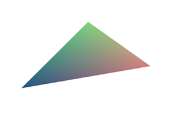
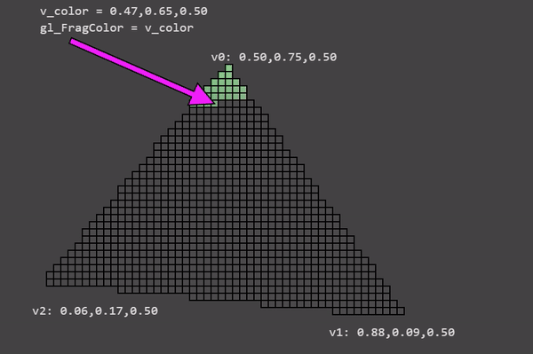

# WebGL fundamentals

## How it works

This tutorial will explain the basic level of what WebGL and your GPU actually do. There are basically 2 parts to this GPU thing. The first part processes vertices (or streams of data) into clip space vertices. The second part draws pixels based on the first part.

When you call

```javascript
var primitiveType = gl.TRIANGLES;
var offset = 0;
var count = 9;
gl.drawArrays(primitiveType, offset, count);
```

The 9 there means "process 9 vertices" so here are 9 vertices being processed.


On the left is the data you provide. The vertex shader is a function you write in GLSL. It gets called once for each vertex. You do some math and set the special variable `gl_Position` with a clip space value for the current vertex. The GPU takes that value and stores it internally.

Assuming you're drawing `TRIANGLES`, every time this first part generates 3 vertices the GPU uses them to make a triangle. It figures out which pixels the 3 points of the triangle correspond to, and then rasterizes the triangle which is a fancy word for “draws it with pixels”. For each pixel it will call your fragment shader asking you what color to make that pixel. Your fragment shader has to set a special variable `gl_FragColor` with the color it wants for that pixel.

That’s all very interesting, but as you can see in our examples up to this point, the fragment shader has very little info per pixel. Fortunately we can pass it more info. We define “varyings” for each value we want to pass from the vertex shader to the fragment shader.

As a simple example, let's just pass the clip space coordinates we computed directly from the vertex shader to the fragment shader.

```javascript
// Fill the buffer with the values that define a triangle.
function setGeometry(gl) {
    gl.bufferData(
        gl.ARRAY_BUFFER,
        new Float32Array([
            50, 200,
            200, 50,
            340, 150]),
        gl.STATIC_DRAW);
}
```

And we have to only draw 3 vertices.

```javascript
...

setGeometry(gl);
// Draw the geometry.
var primitiveType = gl.TRIANGLES;
var offset = 0;
var count = 3;
gl.drawArrays(primitiveType, offset, count);
```

Then in our vertex shader we declare a varying to pass data to the fragment shader.

```javascript
varying vec4 v_color;

...

void main() {
    ...
    
    // Convert from clip space to color space.
    // Clip space goes -1.0 to +1.0
    // Color space goes from 0.0 to 1.0
    v_color = gl_Position * 0.5 + 0.5;
}
```

And then we declare the same varying in the fragment shader.

```javascript
precision mediump float;
 
varying vec4 v_color;
 
void main() {
  gl_FragColor = v_color;
}
```

WebGL will connect the varying in the vertex shader to the varying of the same name and type in the fragment shader.



Try to change the triangle coordinates and see how the colors change.

Now think about it. We only compute 3 vertices. Our vertex shader only gets called 3 times therefore it's only computing 3 colors yet our triangle is many colors. This is why it's called a varying.

WebGL takes the 3 values we computed for each vertex and as it rasterizes the triangle it interpolates between the values we computed for the vertices. For each pixel it calls our fragment shader with the interpolated value for that pixel.


